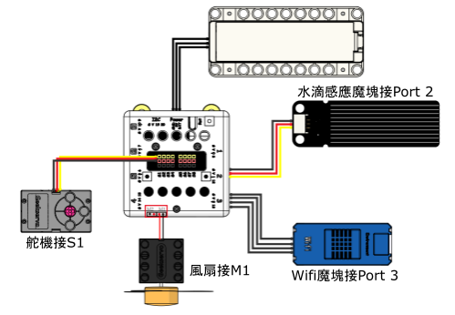
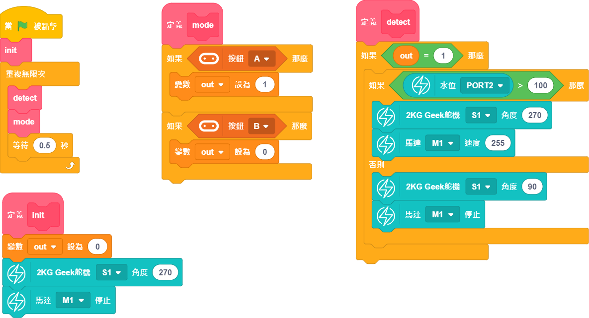

# Smart Hanger

Home automation is a key aspect in smart home. This smart hanger is designed to retract automatically when it is raining.

## Building Instructions and Sample Programs

[Download Resource Pack](http://bit.ly/AIOTKit_SH_ResourcsePack)

## Sample Wiring:

## Sample Program:

## Model Procedure

1. Upload the program onto Micro:bit.
1. Press A to power on the hanger.
2. When rain is detected, the hanger is retracted and the fan is turned on to facilitate drying.