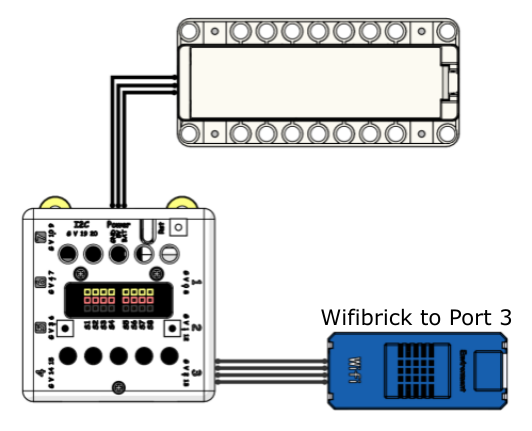
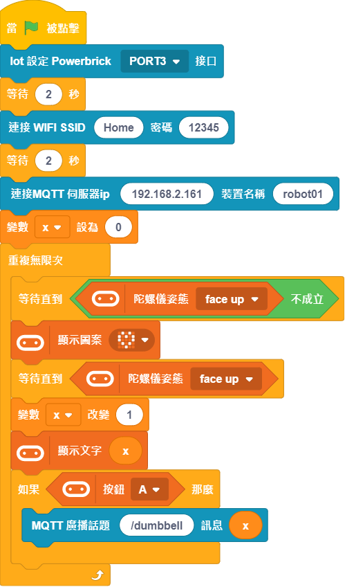
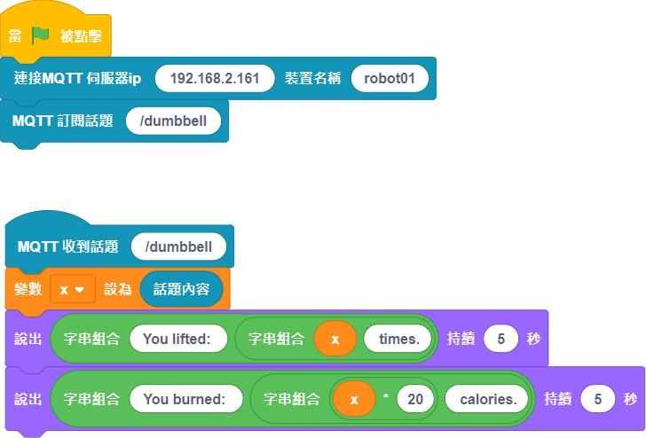

# Smart Dumbbell

Fitness can be combined with IoT to achieve the analyzing of exercise data so that users can keep track of their training. This example simulates a smart dumbbell which can record and calculate the amount of exercises done.

## Building Instructions and Sample Programs

[Download Resource Pack](http://bit.ly/AIOTKit_SH_ResourcsePack)

## Sample Wiring:

## Extensions Needed:

IoT:

## Micro:bit Sample Program

## IoT Sample Program

## Activating the local IoT server

## Model Procedure

1. Turns on the model.
2. Press A to record and upload the training data onto IoT platform.
3. IoT program will report the training data.