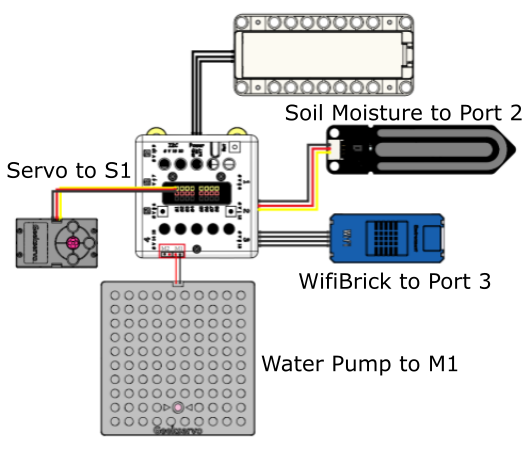

# Smart Plant Irrigation

Growing and grooming plants is a pleasant hobby, in order to keep your beloved plants healthy and well, this smart irrigator can help you monitor the health of your plants and irrigate appropiately.

## Building Instructions and Sample Programs

[Download Resource Pack](http://bit.ly/AIOTKit_SH_ResourcsePack)

## Sample Wiring:

## Extensions needed:

IoT:

## Micro:bit Sample Program:

[Download Sample Program](https://makecode.microbit.org/_MD5hwK62VK6L)

## IoT Sample Program:

## Activating the local IoT server

## Model Procedure

1. Wait for the Wifibrick to connect to the network.
2. Plant is watered when the soil moisture is too low.
3. The program will report on the number of irrigation.