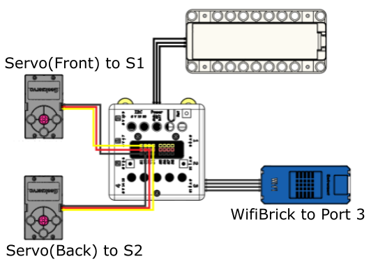
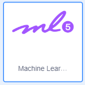
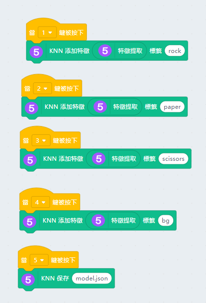
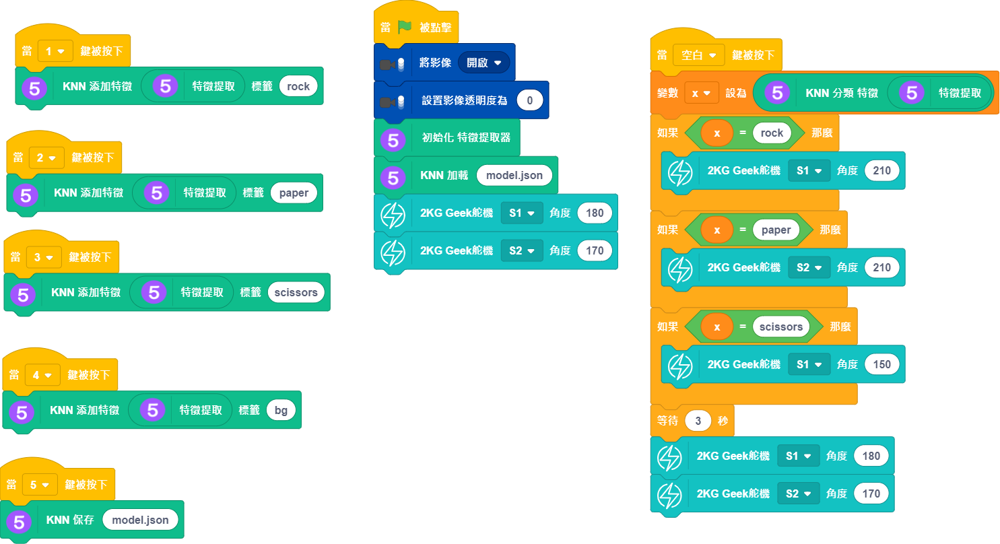

# Rock Paper Scissors

Through machine learning, you can train a machine to play rock paper scissors with you.

## Building Instructions and Sample Programs

[Download Resource Pack](http://bit.ly/AIOTKit_SH_ResourcsePack)

## Sample Wiring:

## Extensions Needed:

Video Capture:

Machine Learning:

## Sample Training Program

## Sample Program

## Model Procedure

1. Train the model using the training program.
2. Open the main program and load the trained model.
3. Connects the Micro:bit to KittenBlock.
4. Press spacebar to start the game.
5. In this sample program, the robot will always win.