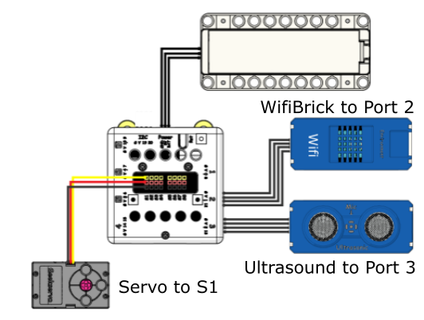
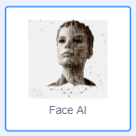
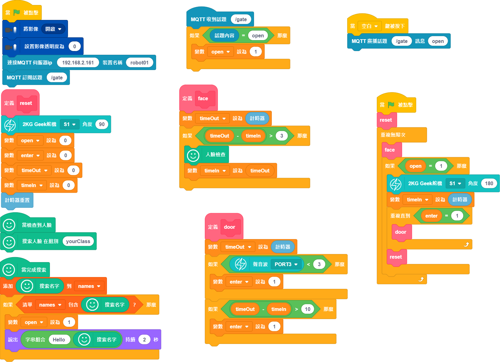

# Private Access Gate

Access control can be realized using biometric data such as face recognition, iris recognition or fingerprints. This model simulates a gate where only authorized people can access using face recognition.

## Building Instructions and Sample Programs

[Download Resource Pack](http://bit.ly/AIOTKit_SH_ResourcsePack)

## Sample Wiring:

## Extensions Needed:

Video Capture:

FaceAI:

IoT:

## Sample Training Program

## Sample Program

## Model Procedure

1. Use the training program to build the database.
2. Open the main program and input the names into the list.
3. Connect the Micro:bit to KittenBlock.
4. The door will open if an authorized face from the database is detected.
5. Pressing spacebar can open the door manually.