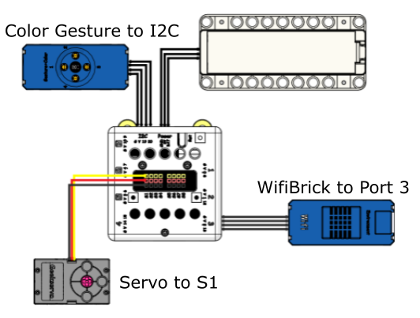

# Automated Parking Lot

By using license plate recognition, this model simulates an automated parking lot that records and calculates the parking fee for the cars in the parking lot.

## Building Instructions and Sample Programs

[Download Resource Pack](http://bit.ly/AIOTKit_SH_ResourcsePack)

## Sample Wiring:

## Extensions Needed:

Video Capture:

Baidu AI:

## Sample Program

## Model Procedure:

1. Connect Micro:bit with KittenBlock.
1. Press 1 to record the number plate of the entering vehicle.
2. Press 2 to record the number plate of the exiting vehicle.
3. The program will display the parking fee paid by the exiting vehicle.