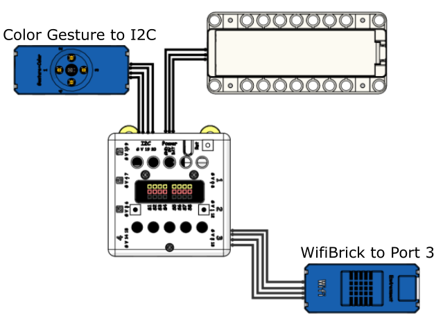
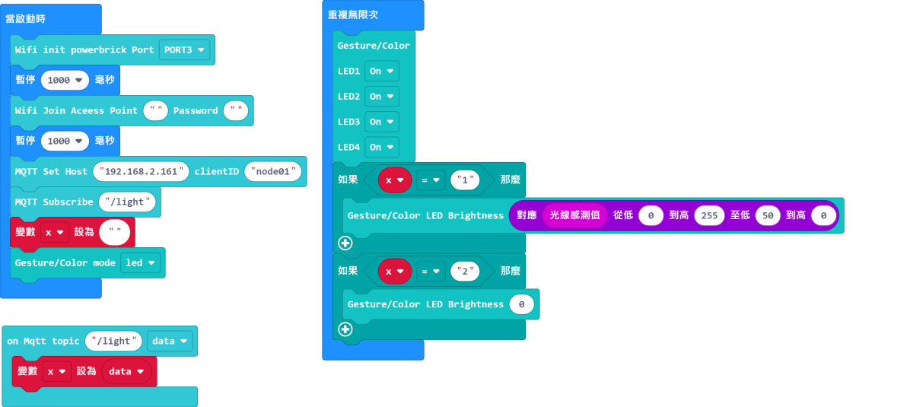
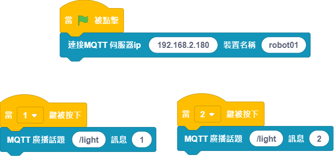

# Smart Road Lamp

A smart road lamp is able to adjust its brightness and is connected to the internet for remote control and monitoring.

## Building Instructions and Sample Programs

[Download Resource Pack](http://bit.ly/AIOTKit_SH_ResourcsePack)

## Sample Wiring:

## Extensions Needed:

IoT:

## Micro:bit Sample Program:

[Download Sample Program](https://makecode.microbit.org/_2p5gAx37q5KD)

## IoT Sample Program:

## Activating the local IoT server

## Program Procedure

1. Wait for the Wifibrick to connect to the internet.
2. Use the IoT program to turn on or off the street lamp.
3. The LED brightness will adapt to the environment brightness.