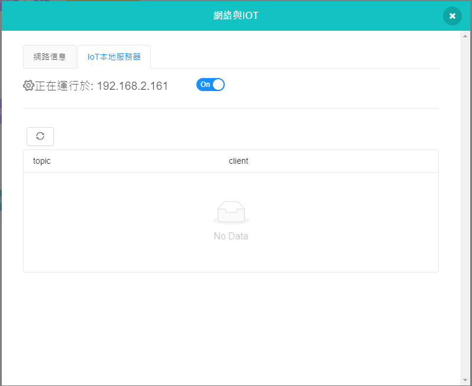

# Local Weather Station

This local weather station keeps track of the temperature and moisture data with the help of IoT platform.

## Building Instructions and Sample Programs

[Download Resource Pack](http://bit.ly/AIOTKit_SH_ResourcsePack)

## Sample Wiring:

## Extensions Needed:

IoT:

## Micro:bit Sample Program

[Download Sample Program](https://makecode.microbit.org/_3gqKev0WHCmW)

## IoT Sample Program

## Activating the local IoT server

## Program Procedure

1. Waits for Wifibrick to connect to the internet.
2. The current temperature and moisture data is displayed on the local gauge.
3. The IoT program reports the current temperature and moisture data periodically.