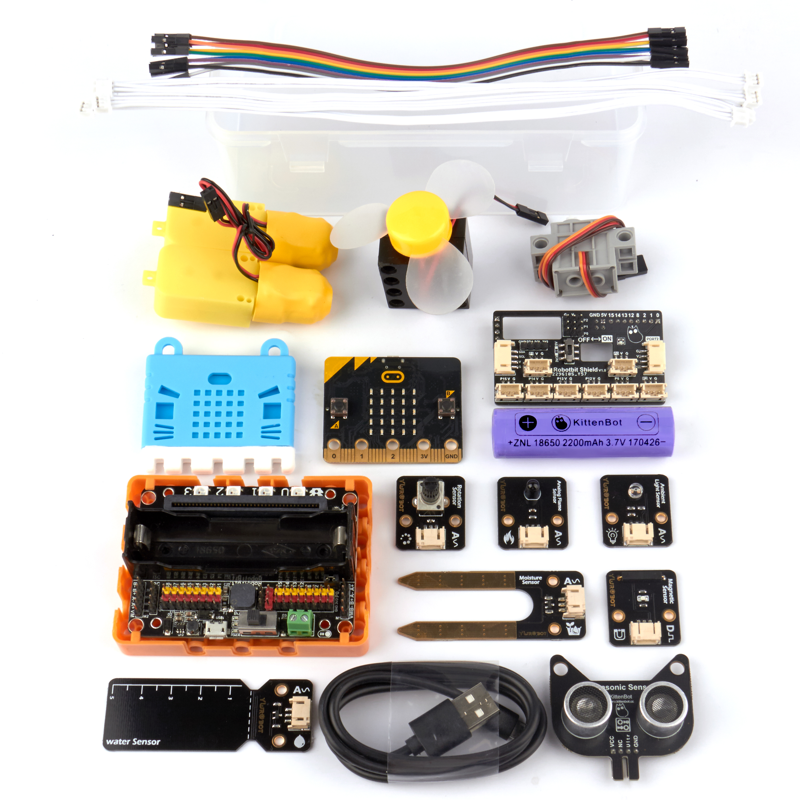
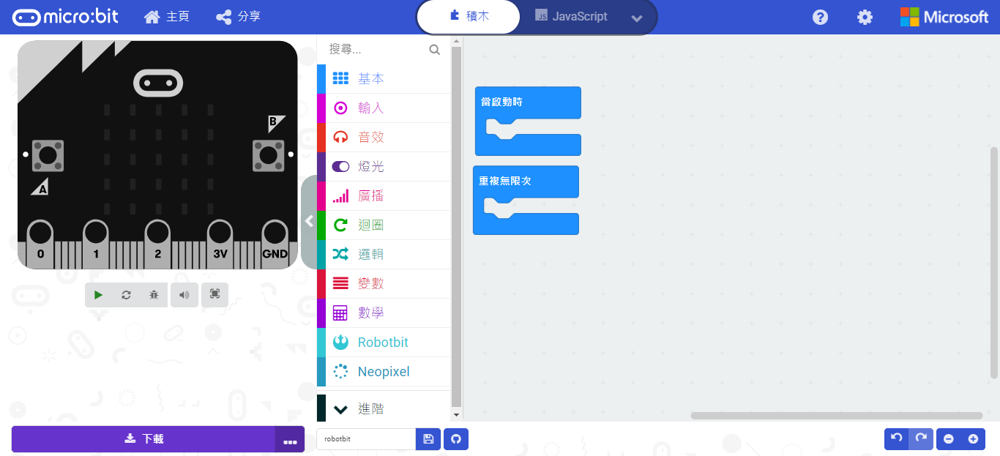
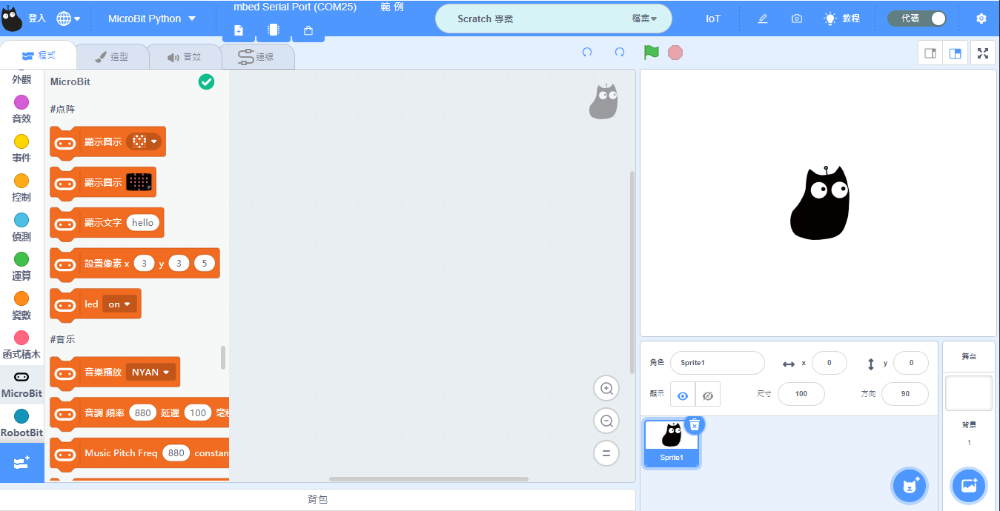

# Robotbit Sensor Kit *Discontinued Item*

Robotbit Sensor Kit

Robotbit Sensor Kit is designed specifically for use in classrooms or training institutions. This kit caters to the needs for educators in Hong Kong, Kittenbot aims to improve teaching efficiency in lessons by including a Robotbit expansion board and many commonly found electronic modules.

## Special features:

1. Based on BBC Micro:bit as the control board, the familiarity improves efficiency.
2. The Robotbit with its Robotbit Shield eliminates the needs for crocodile clips.
3. Robotbit's powerful capabilities can drive multiple motors and servos.
4. Supports modules with PH2.0 ports.
5. Compatible with other sensor modules found on the market.
6. Components can be categorized and stored inside the carrying case.
7. A carrying handle allows for easy portability.

## 套件內容：

- Robotbit x1
- Robotbit Shield x1
- T/T Motors x1 pair
- GeekServo 9G Servo x1
- Lego Fan Module x1
- Ultrasonic Distance Sensor x1
- Potentialmeter Module x1
- Ambient Light Sensor x1
- Flame Sensor x1
- Magnetic Sensor x1
- Soil Moisture Sensor x1
- Water Level Sensor x1
- Wifibrick Module x1 (Only IoT Version)
- Robotbit Base x1
- Microbit Silicon Jacket x1
- Female to Female Dupont wires x20
- 4-Pin Female to PH2.0 wires x2
- 3-Pin PH2.0 wires x2
- 18650 Lithium-Ion Battery x1
- USB cable x1

## Programming Platform

- Microsoft Makecode

- Kittenblock

## Introduction Video

## Unboxing

