# Micro:bit Inventor Education Kit

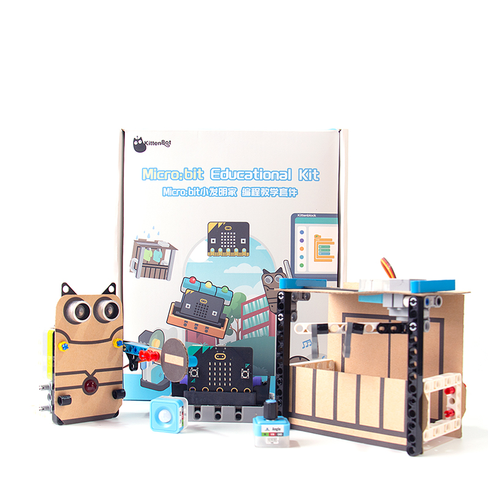

Micro:bit Inventor Education Kit is designed for widespread STEM education, this kit comes with the new Robotbit Edu and the new sensor series Sugar. 10 Use Case Scenarios can be built with the building blocks and Cardboard to inspire the creativity and maker spirit in students.

## Special Features

- Combining Programming and Model Construction for a more concrete and comprehensive learning experience
- Employs the new Sugar series of sensors, improving safety and convenience
- Based on the new Robotbit Edu that features PH2.0 connectors for easier wiring

## Specifications

- Main Controller: BBC Micro:bit V2
- Package Size: 205 x 182 x 75 mm

## Package Contents

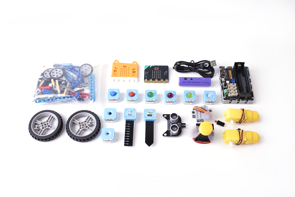

- Micro:bit V2 x1(Optional)
- Robotbit Edu x1
- Robotbit Base Adapter x1
- 18650 Lithium-Ion Battery x1
- Sugar LED x3
- Sugar Buttons x2
- Sugar Light Sensor x1
- Sugar Potentiometer x1
- Sugar PIR x1
- Sugar Flame Sensor x1
- Sugar Soil Moisture Sensor x1
- Sugar Rain and Water Level Sensor x1
- Neko Ultrasound x1
- GeekServo 9G Servo x1
- GeekServo GeekFan x1
- TT Motors x2
- 3Pin Wires x6
- 3Pin to 4Pin Wire x1
- Plastic Building Bricks x1
- Cardboard Set x1
- 1m USB Cable x1

### Programming Platform

- Microsoft Makecode
- KittenBlock

## Features

### Combining Programming and Model Construction for a more concrete and comprehensive learning experience

### Employs the new Sugar series of sensors, improving safety and convenience

### Based on the new Robotbit Edu that features PH2.0 connectors for easier wiring

## Demo Video

[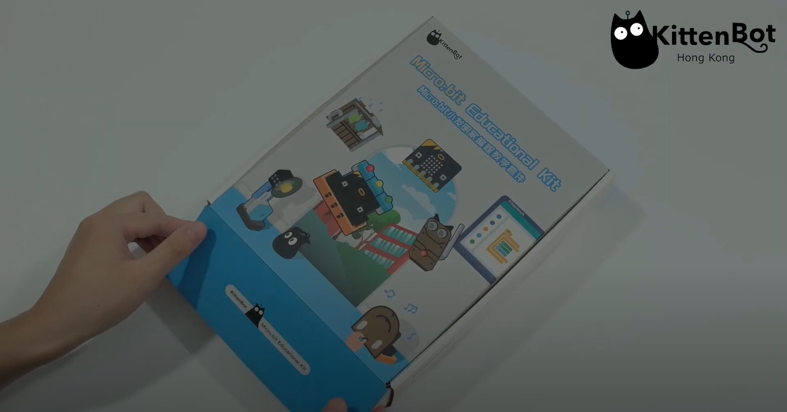](https://youtu.be/JaBa2EcIPDU)

## Use Case Scenarios

### Fire Alarm

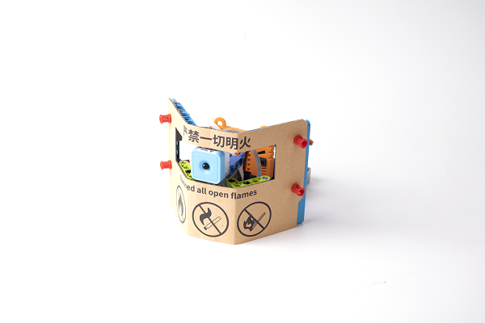

Alarm will sound when fire is detected.

    Intended to use with Micro:bit V2.

### Birthday Candles

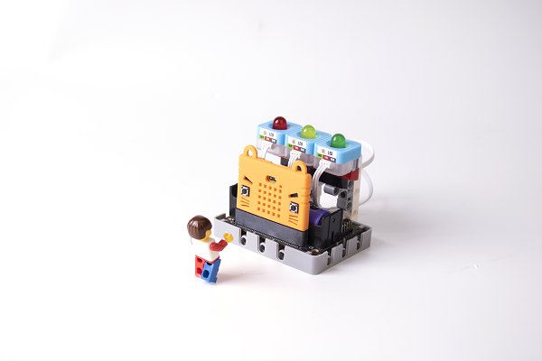

Blow on the Micro:bit V2 to blow the candles.

    Intended to use with Micro:bit V2.

### Electric Gate

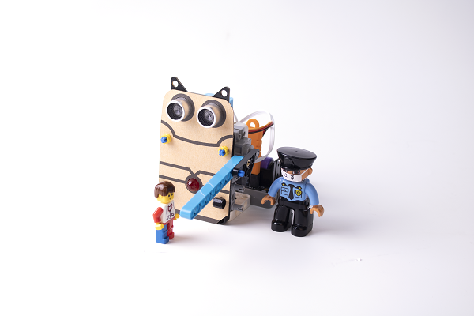

Door closes and opens automatically.

### Plant Helper

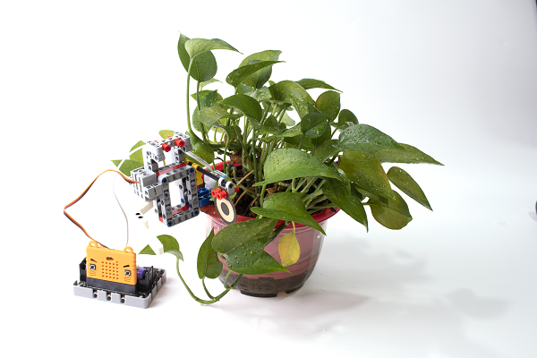

Alarm will sound when soil is too wet or too dry.

    Intended to use with Micro:bit V2.

### Traffic Light

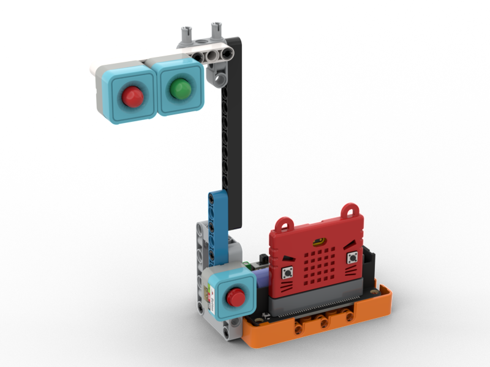

Green light will be lit to allow crossing of the road.

### Delivery Kart

The automatic kart can avoid obstacles.

    Intended to use with Micro:bit V2.

### Remote Controlled Kart

This kart can be remotely controlled with another Micro:bit.

    注意：此案例需要配合Micro:bit V2使用。

### Smart Hanger

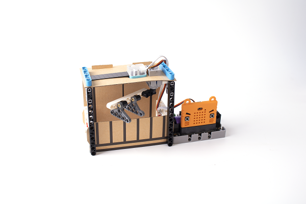

Hanger automatically retracts when rain is detected.

### Zombie Game

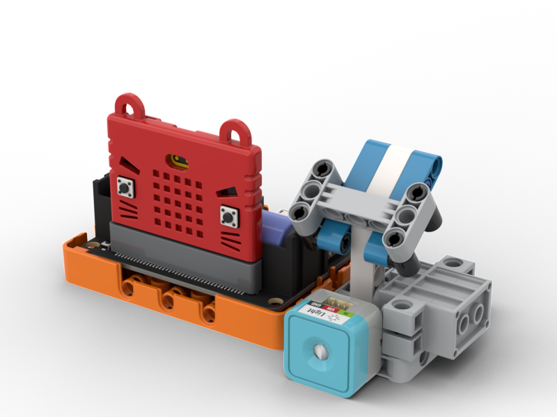

Use a light to kill the jumping zombie.

    Intended to use with Micro:bit V2.

### Swinging Fan

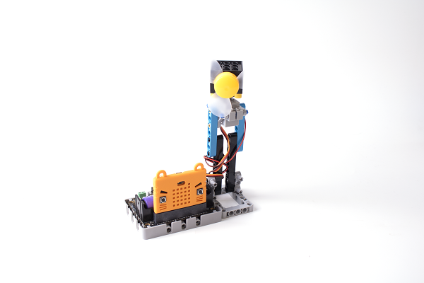

Electric Fan will swing left and right.

### Nightlight

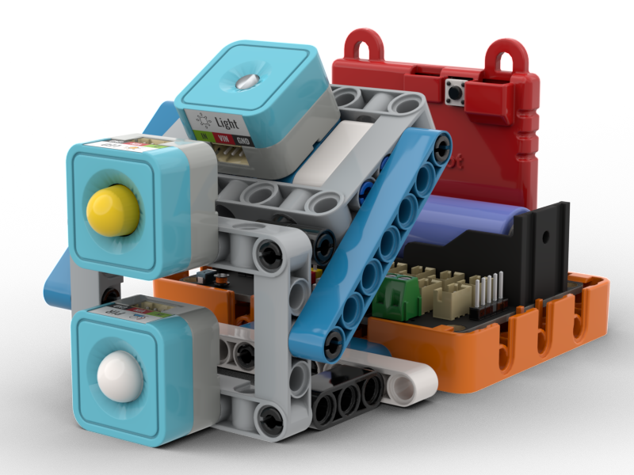

Lights up when movement is detected to prevent tripping.

### Radio

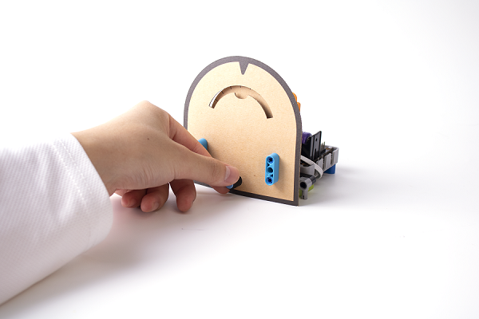

Turn the potentiometer until music can be heard.

    Intended to use with Micro:bit V2.

### Rhythm Machine

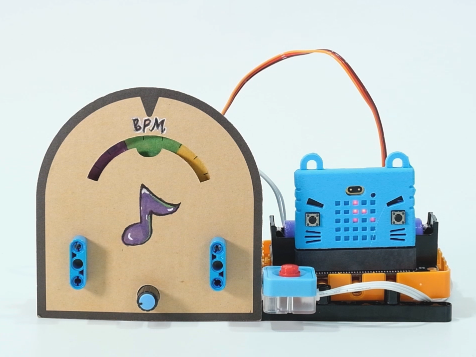

Adjust the BPM and the beat to help you practice music.

    Intended to use with Micro:bit V2.

### Quiz Machine

Whoever presses the button quickly can answer the question.

    Intended to use with Micro:bit V2.

### Safe

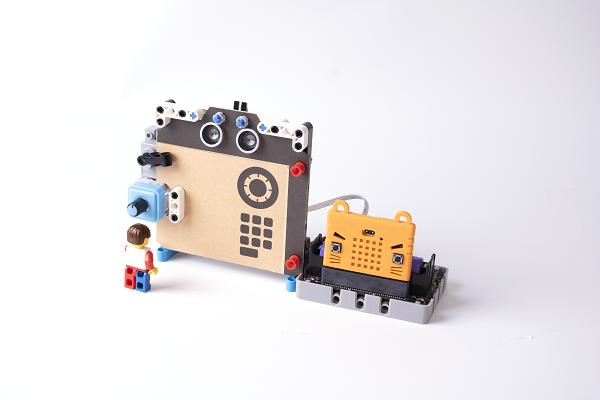

Enter the correct password to open to safe.

    Intended to use with Micro:bit V2.

### Piano

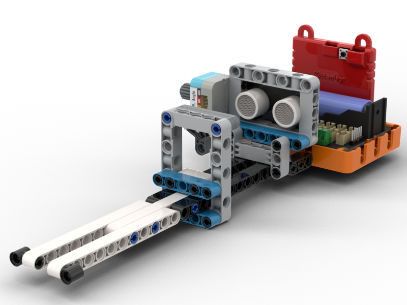

Use distance to control the notes of this musical instrument.

    Intended to use with Micro:bit V2.