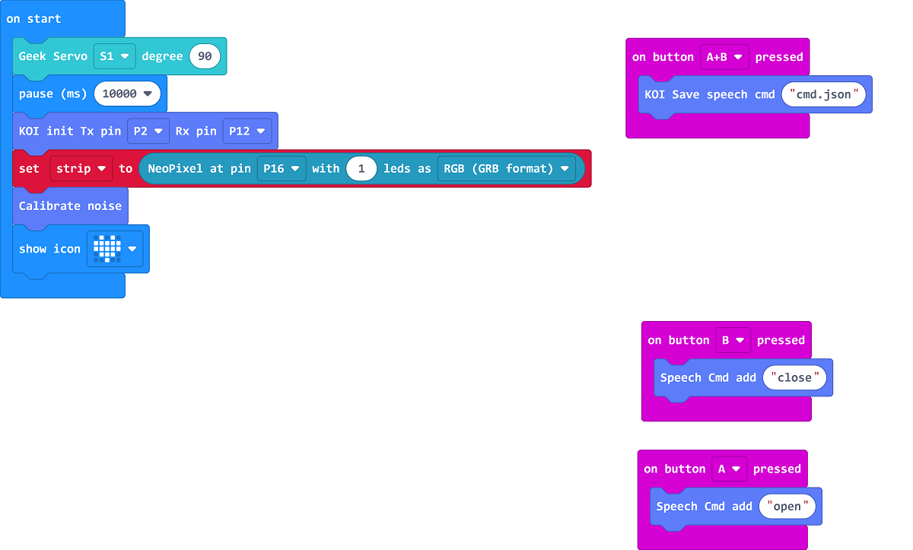
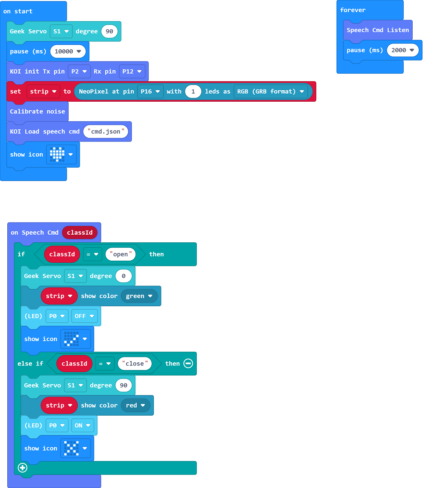

# AI Access Gate Control

## Building Instructions

[Building Instructions](https://drive.google.com/drive/folders/1vPB1nm2KgCbI8fHl_VWVD3YiAxTgYQWc?usp=sharing)

## Sample Program

### Training Program

[Sample Program](https://makecode.microbit.org/_M1s2gMdRAhTy)

### Main Program

[Main Program](https://makecode.microbit.org/_C0XAkCKt3Kcu)

## Program Instructions

Use the training program to train the voice model, press A to record "Open", press B to record "Close", press A+B to save the model.

In the main program, control the hanger by saying Open or Close.
