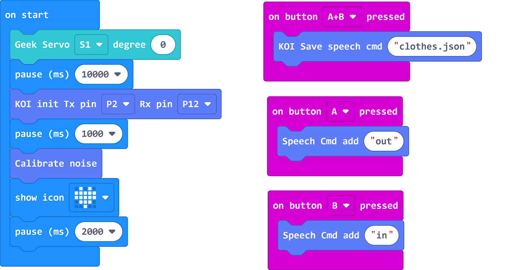

# Voice Control AI Hanger

## Building Instructions

[Building Instructions](https://drive.google.com/drive/folders/1vPB1nm2KgCbI8fHl_VWVD3YiAxTgYQWc?usp=sharing)

## Sample Program

### Training Program

[Sample Program](https://makecode.microbit.org/_i6od5EPD2PT8)

### Main Program

[Sample Program](https://makecode.microbit.org/_5Ky879De1ebM)

## Program Instructions

Use the training program to train the voice model, press A to record "Out", press B to record "In", press A+B to save the model.

In the main program, control the hanger by saying In or Out.