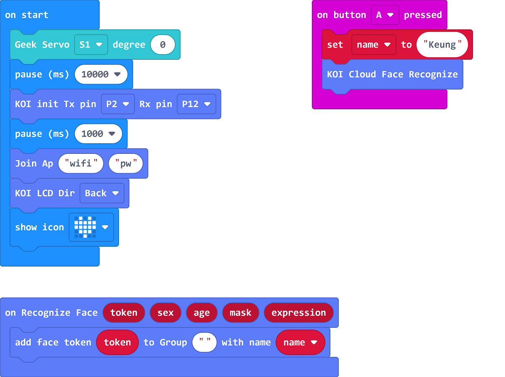

# Biometrics Authentication Safe Locker

## Building Instructions

[Building Instructions](https://drive.google.com/drive/folders/1vPB1nm2KgCbI8fHl_VWVD3YiAxTgYQWc?usp=sharing)

## Sample Program

### Training Program

[Sample Program](https://makecode.microbit.org/_Hir6kKLXcYUk)

### Main Program

[Sample Program](https://makecode.microbit.org/_D8jDyuUzs4pP)

## Program Instructions

Use the training program to build a face database, press A to add a person named "Keung".

In the main program, press A to recognize a face, if the face matches to "Keung", the locker will open.