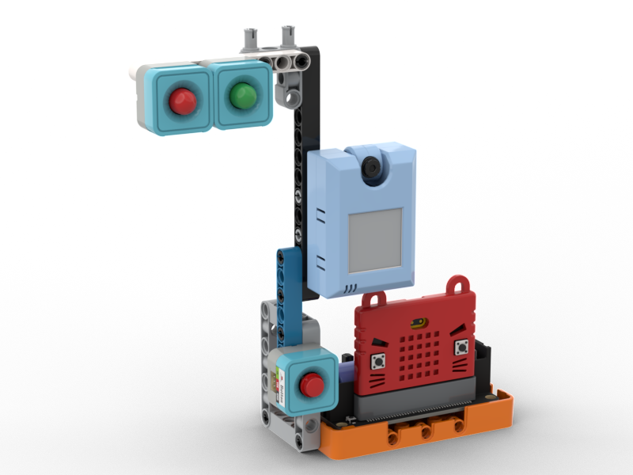
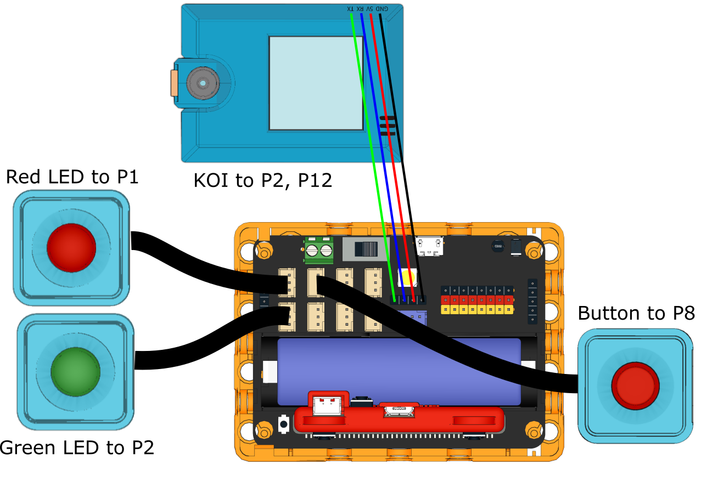
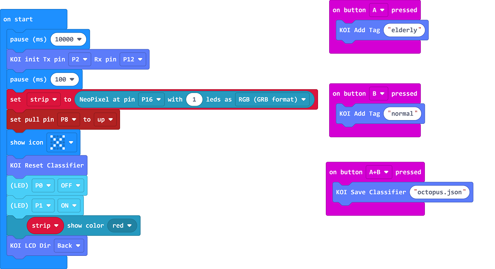
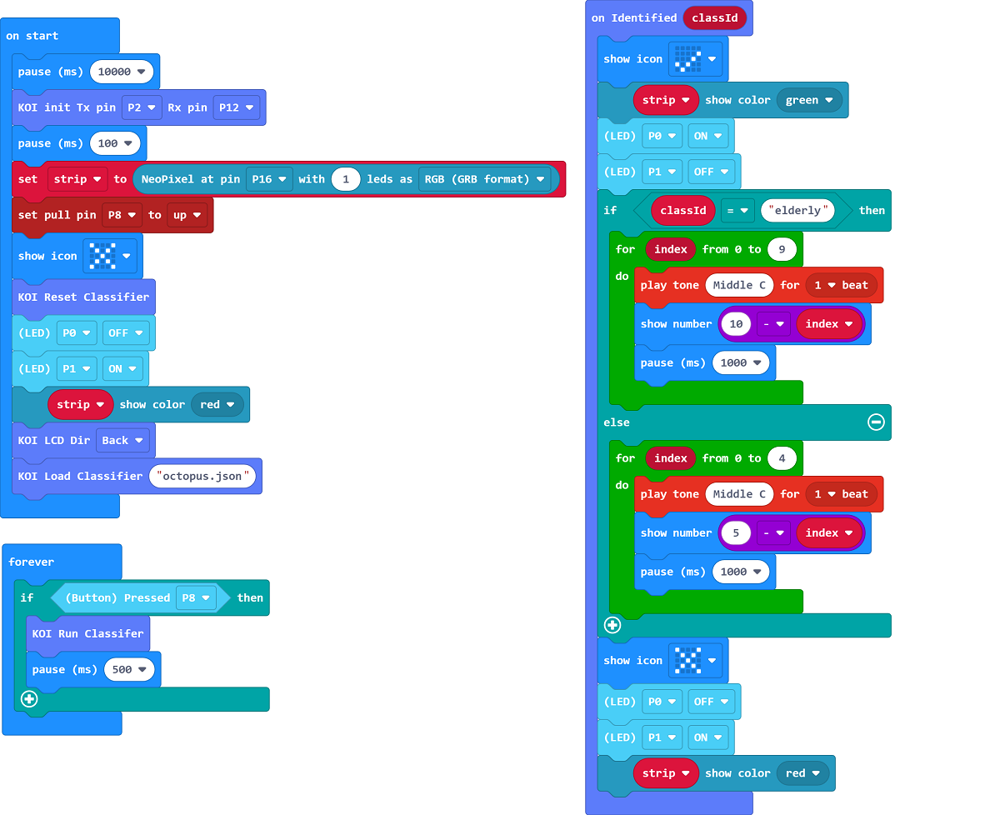

# AI Pedestrian Crossing

## Building Instructions

[Download Building Instructions](https://drive.google.com/drive/folders/1vPB1nm2KgCbI8fHl_VWVD3YiAxTgYQWc?usp=sharing)

## Sample Program

### AI Training

[Sample Program](https://makecode.microbit.org/_1xAgL0RtD6fy)

### Main Program

[Sample Program](https://makecode.microbit.org/_i0JT9q5h10oo)

## Program Instructions

Use the Training program to train the AI Model, press A to train Elderly/Child Octopus Card, press B to train Adult Octopus Card, press A+B to save the AI model.

Use the Main program to see the results, press the red button to recognize an Octopus Card, the system will give more time for children or elderly to cross the road.