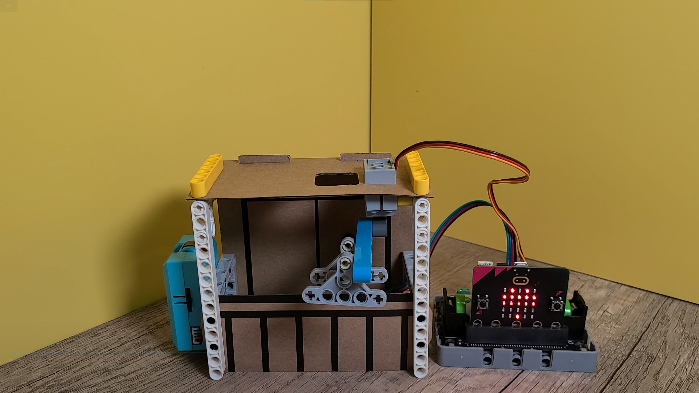
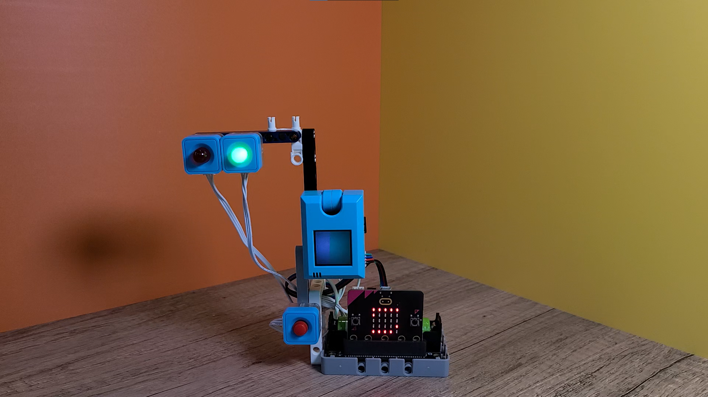
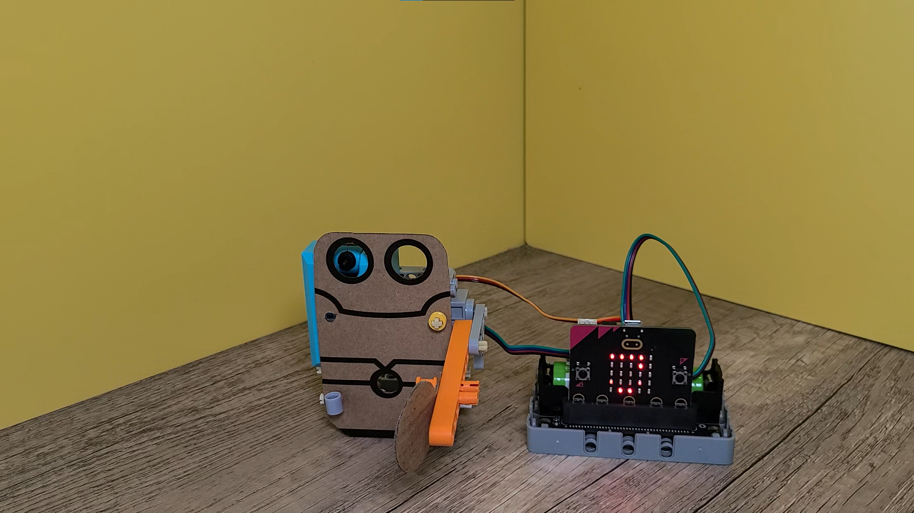
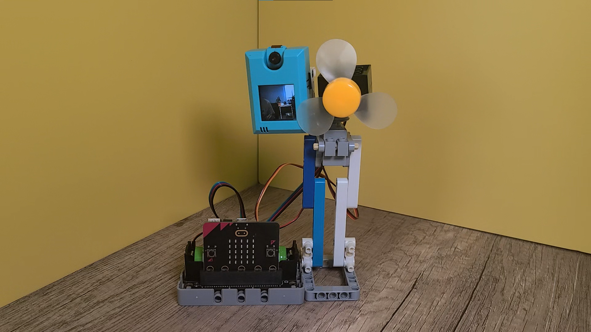
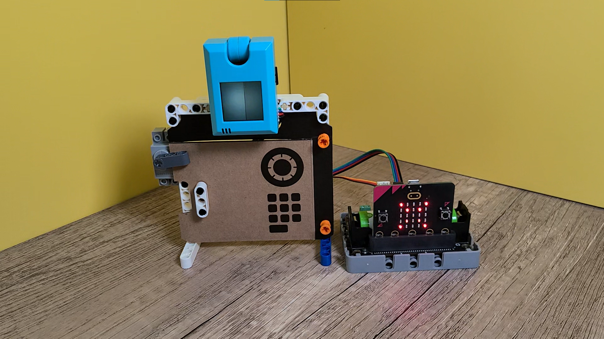

# Micro:bit Inventor Kit x KOI AI Camera Use Cases

Adding a KOI AI Camera allows more functionality for Micro:bit Inventor Kit, the following cases are upgraded by using a KOI.

## Voice Control AI Hanger

[Watch On Youtube](https://youtu.be/aO9EQKJsBQI?t=12)

## AI Pedestrian Crossing

[Watch On Youtube](https://youtu.be/aO9EQKJsBQI?t=28)

## AI Access Control

[Watch On Youtube](https://youtu.be/aO9EQKJsBQI?t=75)

## AI Face Tracking Fan

[Watch On Youtube](https://youtu.be/aO9EQKJsBQI?t=91)

## Biometric Authentication Safe Locker

[Watch On Youtube](https://youtu.be/aO9EQKJsBQI?t=125)