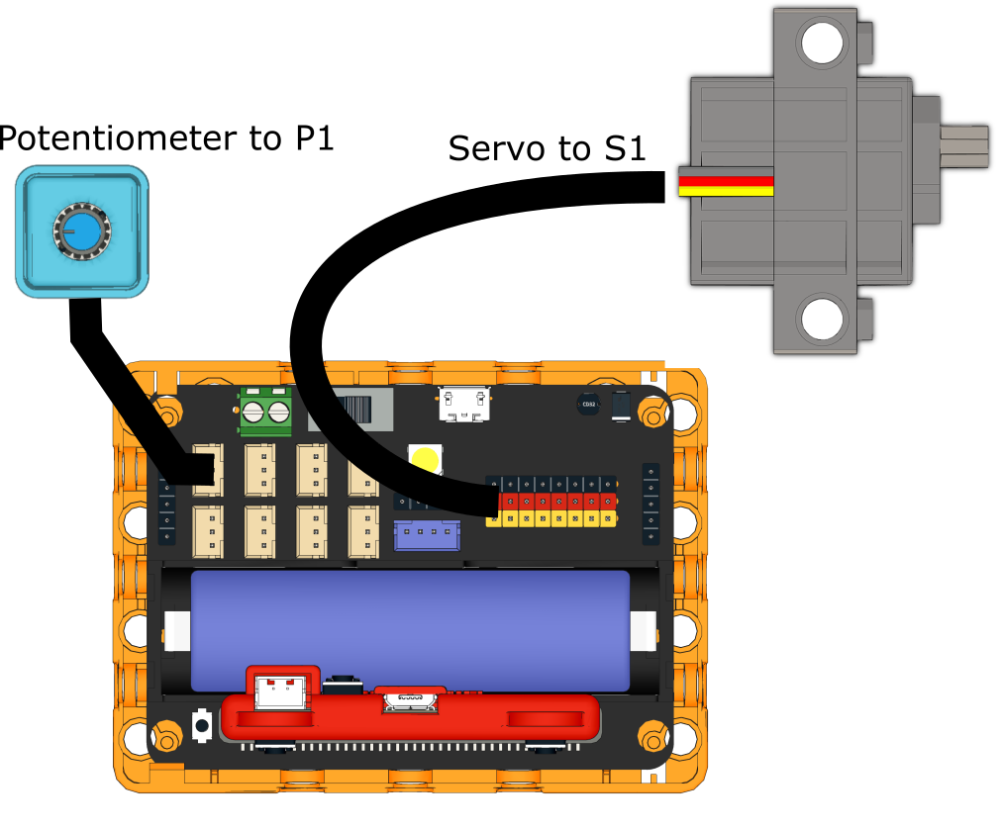
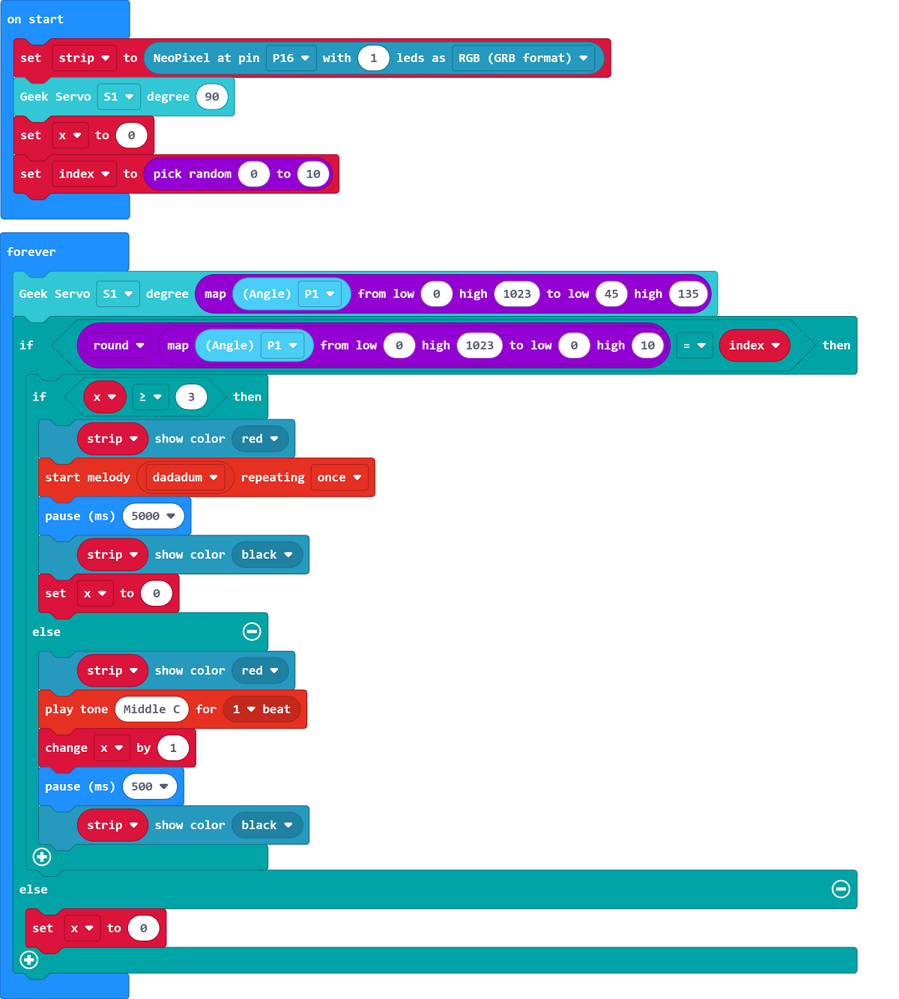

# Radio

## Building Instructions

[Building Instructions](https://drive.google.com/drive/folders/1wg_edUZFrqyUONA0FJ6vFBkGArRsfnf4?usp=sharing)

## Sample Program

[Sample Program](https://makecode.microbit.org/_PreDj35LFRdm)

## Instructions

Adjust the potentiometer until music can be heard.