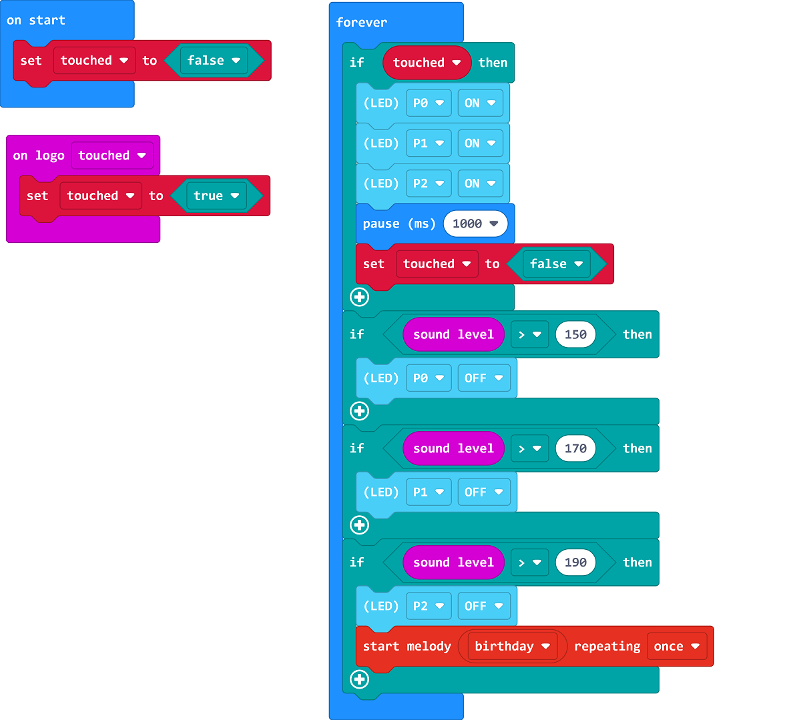

# Birthday Candles

## Building Instructions

[Building Instructions](https://drive.google.com/drive/folders/1wg_edUZFrqyUONA0FJ6vFBkGArRsfnf4?usp=sharing)

## Sample Program

[Sample Program](https://makecode.microbit.org/_465hMjiRwTXH)

## Instructions

Press the Micro:bit V2 logo to light up the candles, blow on the microphone to blow them out.