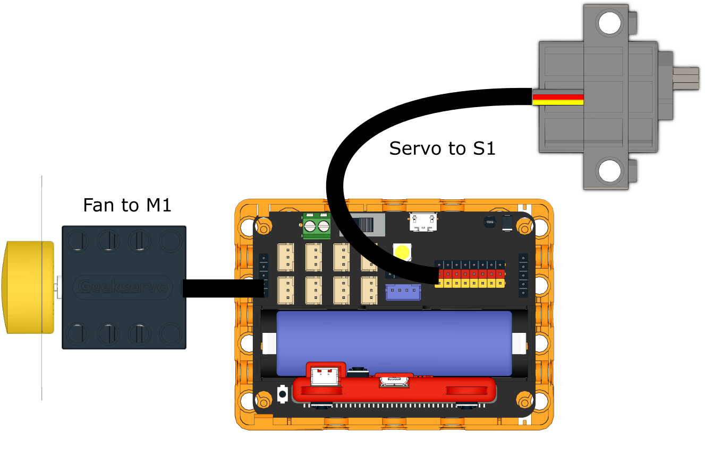
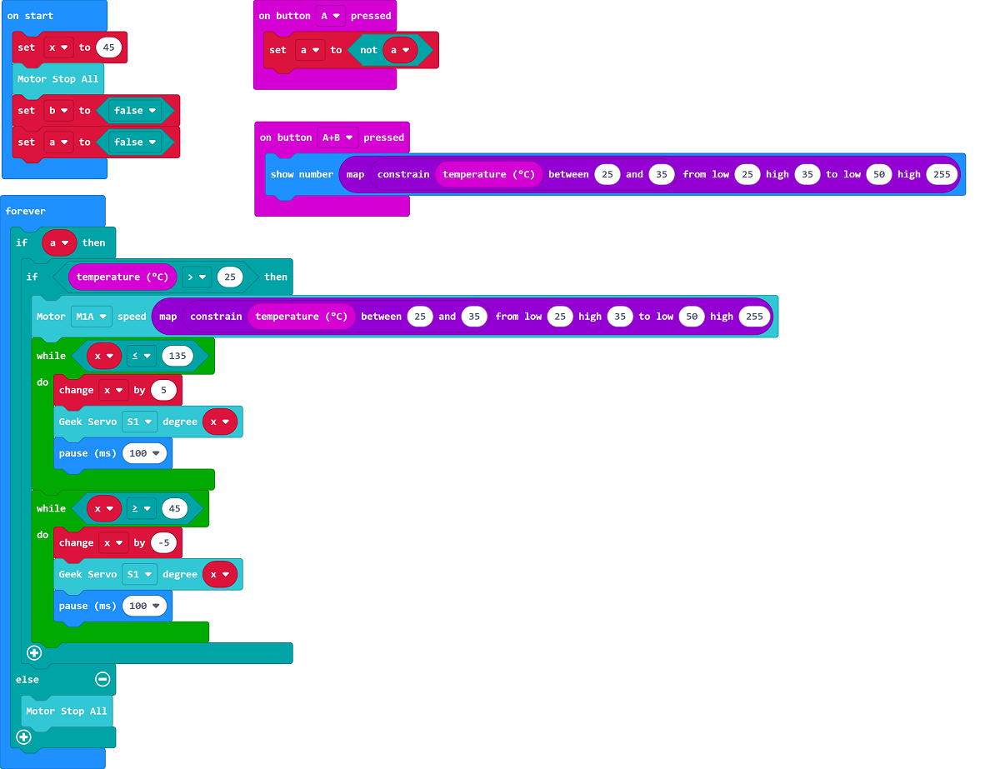

# Swinging Fan

## Building Instructions

[Building Instructions](https://drive.google.com/drive/folders/1wg_edUZFrqyUONA0FJ6vFBkGArRsfnf4?usp=sharing)

## Sample Program

[Sample Program](https://makecode.microbit.org/_LsLWea63oXHe)

## Instructions

Press A to turn on the fan, the fan speed will increase or decrease according to the current temperature.