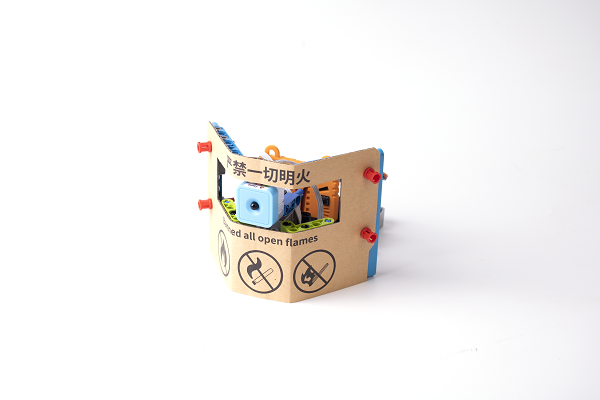

# Fire Alarm

## Building Instructions

[Building Instructions](https://drive.google.com/drive/folders/1wg_edUZFrqyUONA0FJ6vFBkGArRsfnf4?usp=sharing)

## Sample Program

[Sample Program](https://makecode.microbit.org/_UTFC59a5m1Fq)

## Instructions

The fire detector will swing left and right and sound an alarm if fire is detected.