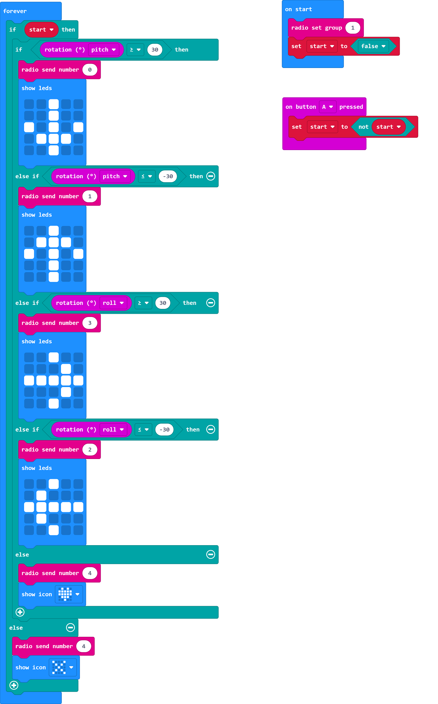
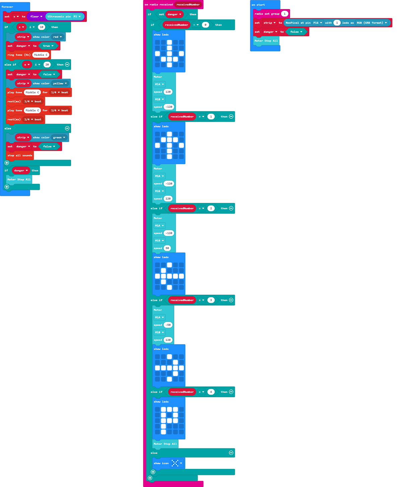

# RC Kart

## Building Instructions

[Building Instructions](https://drive.google.com/drive/folders/1wg_edUZFrqyUONA0FJ6vFBkGArRsfnf4?usp=sharing)

## Sample Program

### Remote Controller

[Sample Program](https://makecode.microbit.org/_WjpcefWkccgi)

### RC Kart

[Sample Program](https://makecode.microbit.org/_R28XdPCxb17e)

## Instructions

Tilt the Remote Controller to drive the RC Kart.