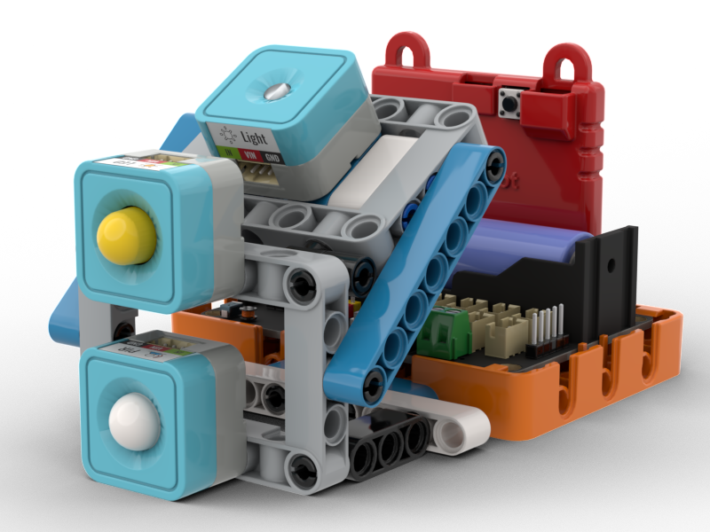
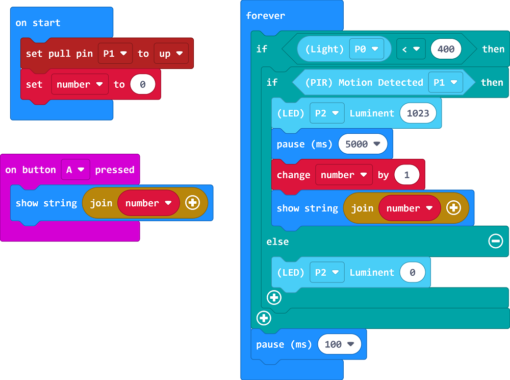

# Nightlight

## Building Instructions

[Building Instructions](https://drive.google.com/drive/folders/1wg_edUZFrqyUONA0FJ6vFBkGArRsfnf4?usp=sharing)

## Sample Program

[Sample Program](https://makecode.microbit.org/_D9X8tiDfF99a)

## Instructions

When movement is detected, the night light turns on for a period so that the person would not trip and fall over.
