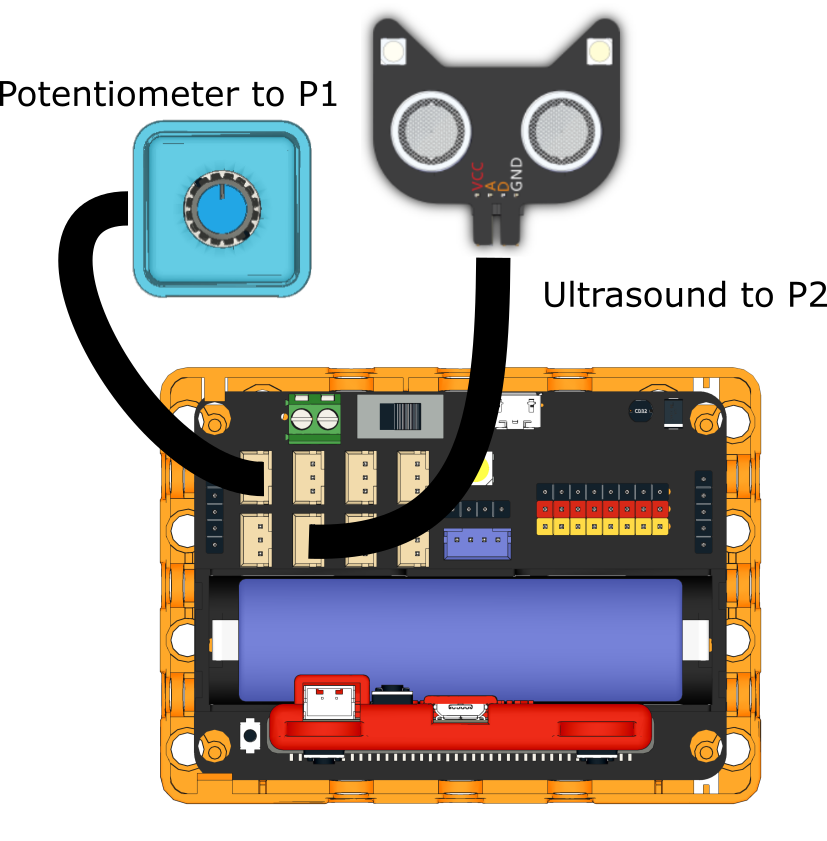

# Piano

## Building Instructions

[Building Instructions](https://drive.google.com/drive/folders/1wg_edUZFrqyUONA0FJ6vFBkGArRsfnf4?usp=sharing)

## Sample Program

[Sample Program](https://makecode.microbit.org/_WMPXPP522Fqt)

## Instruction

Control the note by sliding the panel back and forth, turn the potentiometer to control the major.