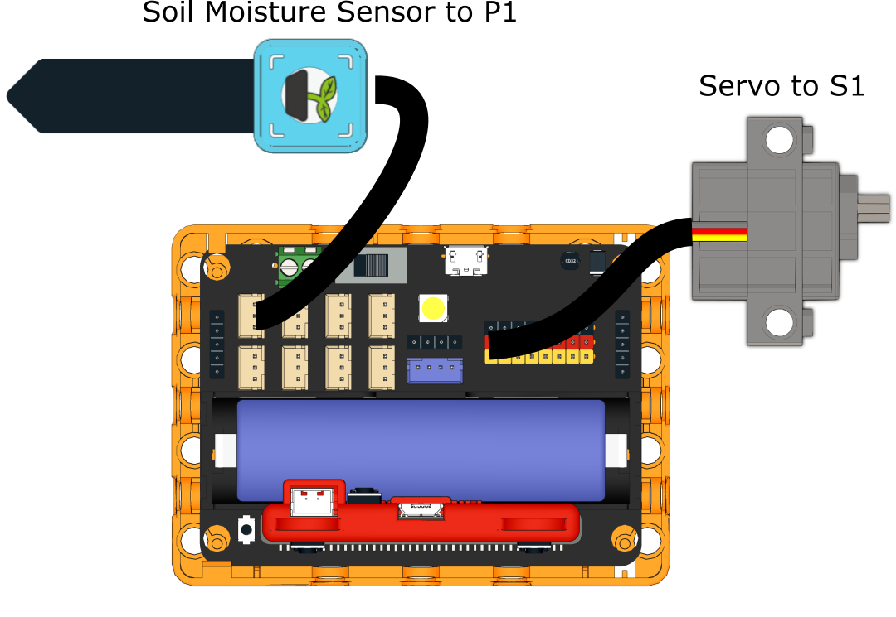

# Plant Helper

## Building Instructions

[Building Instructions](https://drive.google.com/drive/folders/1wg_edUZFrqyUONA0FJ6vFBkGArRsfnf4?usp=sharing)

## Sample Program

[Sample Program](https://makecode.microbit.org/_RmuazT3u3KAD)

## Instructions

Insert the soil moisture sensor into the soil of the flower pot, alarm will sound when the soil moisture is too low.