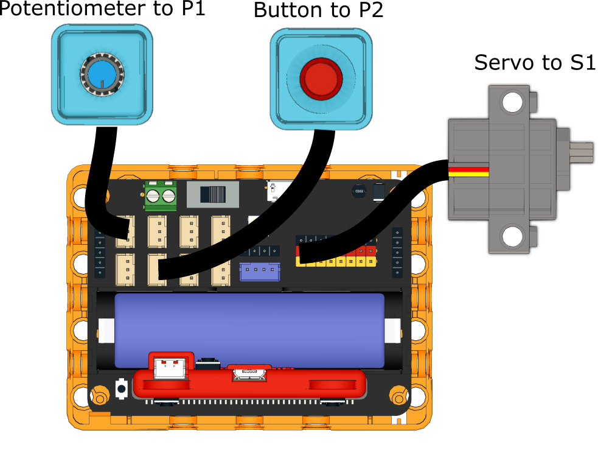

# Rhythm Machine

## Building Instructions

[Building Instructions](https://drive.google.com/drive/folders/1wg_edUZFrqyUONA0FJ6vFBkGArRsfnf4?usp=sharing)

## Sample Program

[Sample Program](https://makecode.microbit.org/_gCcc9XVe7YLm)

## Instructions

Adjust the speed by turning the potentiometer, select the beats by pressing A or B. Press the red button to enable the machine.
