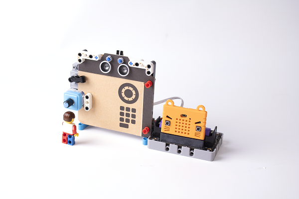

# Safe

## Building Instructions

[Building Instructions](https://drive.google.com/drive/folders/1wg_edUZFrqyUONA0FJ6vFBkGArRsfnf4?usp=sharing)

## Sample Program

[Sample Program](https://makecode.microbit.org/_4Wg2cdE1g75K)

## Instructions

Select letters by turning the potentiometer, press A to enter the letter. Press B to confirm the password, the door will open if the password is correct.
使用電位器選擇字母，按A輸入。輸入所有字母之後按B確認，假如密碼正確就會打開夾萬。