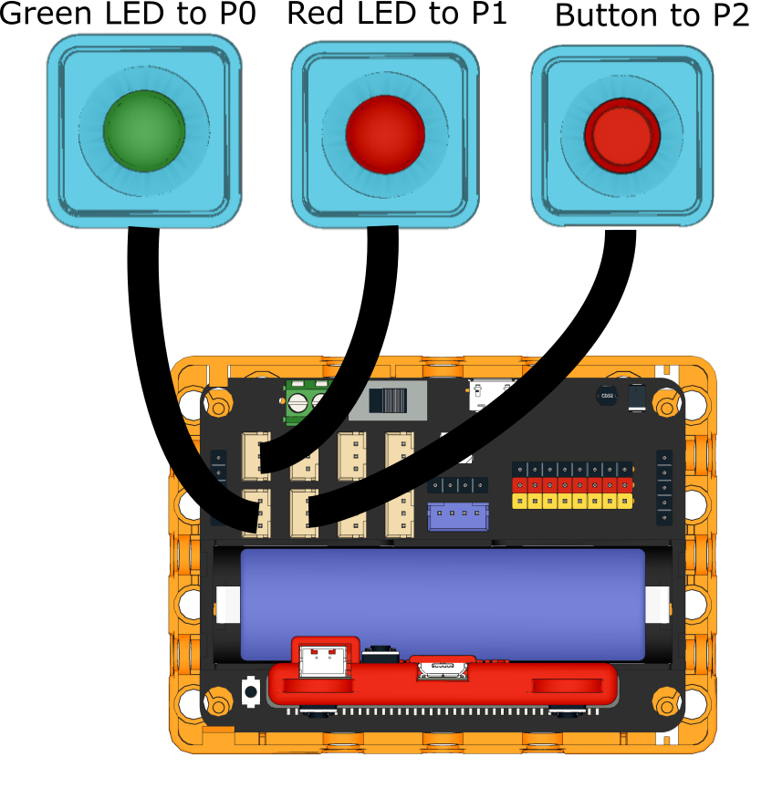
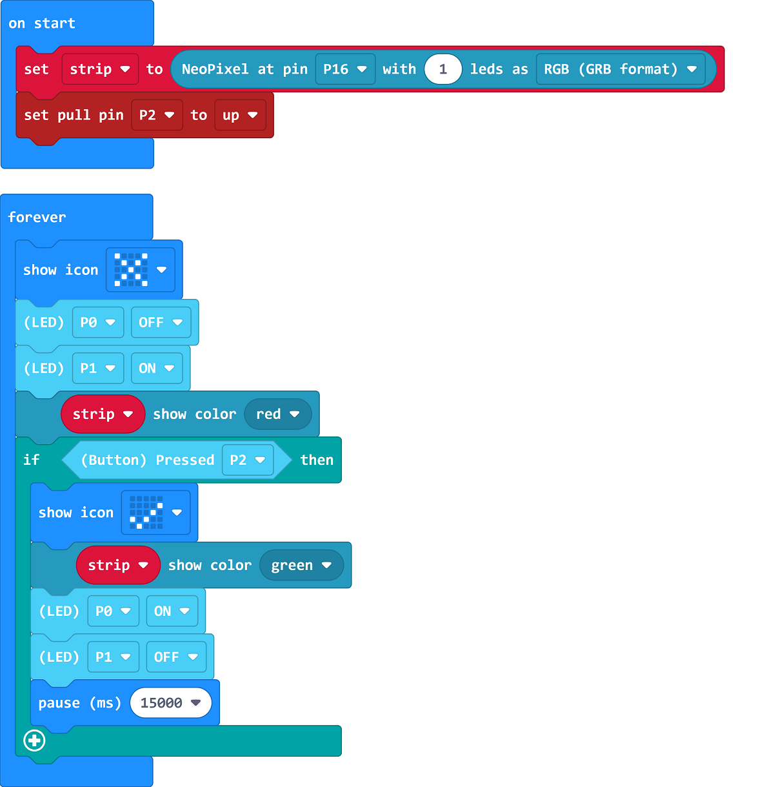

# Traffic Lights

## Building Instructions

[Building Instructions](https://drive.google.com/drive/folders/1wg_edUZFrqyUONA0FJ6vFBkGArRsfnf4?usp=sharing)

## Sample Program

[Sample Program](https://makecode.microbit.org/_efiLX59R5C43)

## Instructions

Press A will make the lights go green for a period to let people cross the road.