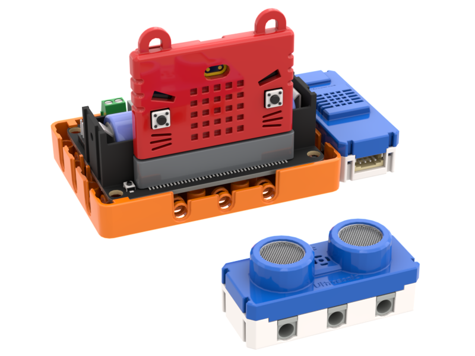

# KittenBot Fitness Testing Kit

KittenBot Fitness Testing Kit is an education kit that focuses around fitness testing, the kit includes 5 sets of devices to facilitate fitness exercises including Push Up, Sit Up, Sit and Reach, Y-Balance and Planking.

The devices incorporate WifiBrick to realize the combination of Fitness and IoT. KittenBot aims to combine STEM and PE to encourage a healthy lifestyle among students.

## Special Features

- Combining STEM and PE and realize STEM's goal of cross-subjects learning
- Applies IoT technology to PE through the use of WifiBrick
- Includes 5 sets of common exercise testing kit
- Encourages an active lifestyle

## Kit Contents

- Robotbit Edu x9
- Powerbrick Ultrasound Sensor x3
- Sugar TOF Sensor x3
- Sugar Button Sensor x1
- WifiBrick x5
- 18650 Lithium Ion Battery x5
- Connecting Cables
- Plastic Building Bricks Set 

## Kit Details

### 1. Push-Up Exercise

The number of push-ups can be uploaded to the IoT platform.

### 2. Sit-Up Exercise

The number of sit-ups can be uploaded to the IoT platform.

### 3. Sit and Reach Test

Measure the sit and reach distance and upload to IoT platform.

### 4. Y-Balance Test

Measure the Y-Balance distance and upload to IoT platform.

### 5. Plank Exercise

The duration of planking can be uploaded to the IoT platform.

