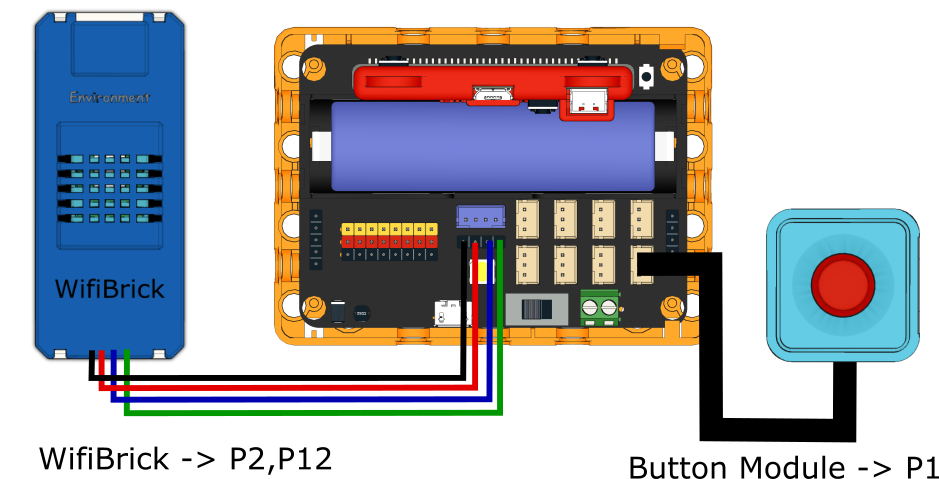
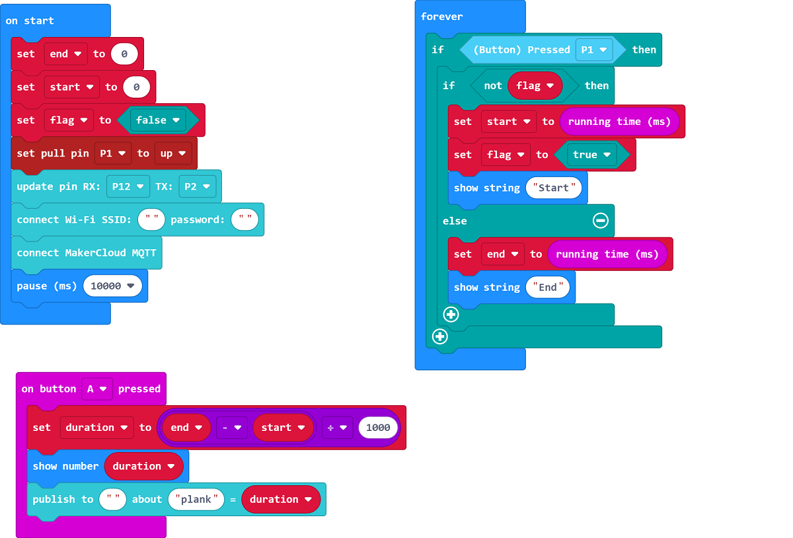

# 5. Plank Exercise

The duration of planking can be uploaded to the IoT platform.

## Building Instructions

[Building Instructions]()

## Sample Program

[Sample Program](https://makecode.microbit.org/_bLA2urgA7L92)

## Instructions

2. Turn on the Robotbit and wait for Wifibrick to connect to MakerCloud.
3. Press the button to begin timer.
4. Press button again to stop timer.
5. Press A to see the duration and upload the data onto MakerCloud.