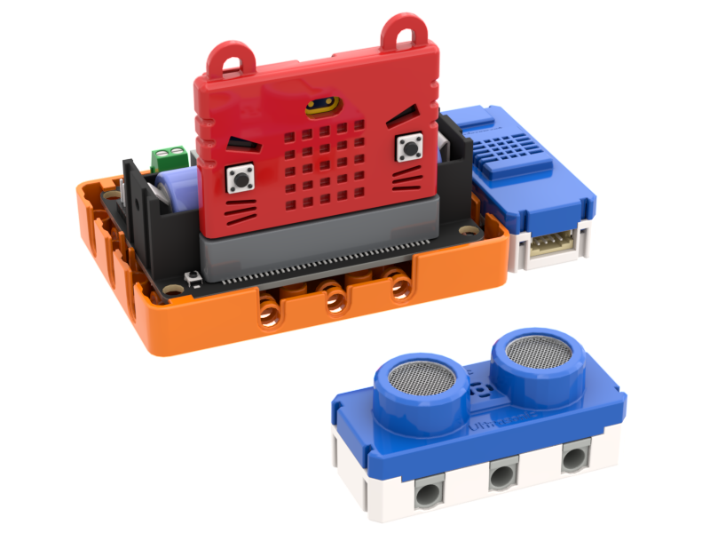
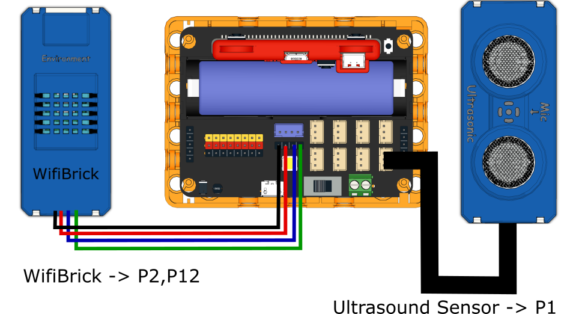
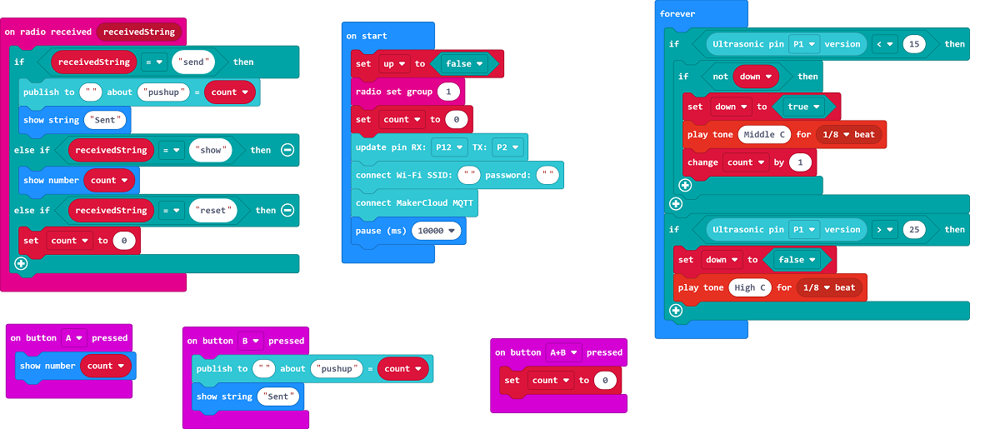

# 1. Push-Up Exercise

The number of push-ups can be uploaded to the IoT platform.

## Building Instructions

[Building Instructions]()

## Sample Program

[Sample Program](https://makecode.microbit.org/_J0LH7kKtrYwA)

## Instructions

1. Place the ultrasound sensor below the user's chest.
2. Turn on the Robotbit and wait for Wifibrick to connect to MakerCloud.
3. When the user's body is less than 15cm to the ground, the device beeps to notify the user to go up. When the user's body is higher than 25cm, the device beeps to notify the user to go down.
4. Press A to see the number of push-ups done
5. Press B to upload the data to MakerCloud.
4. Press A+B to reset the counter to 0.