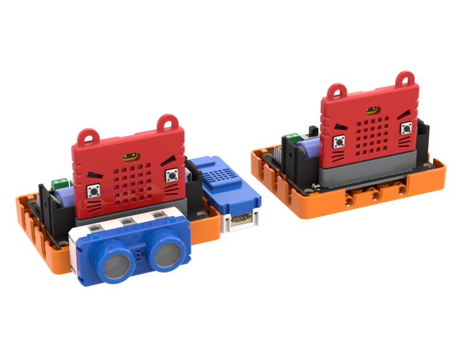
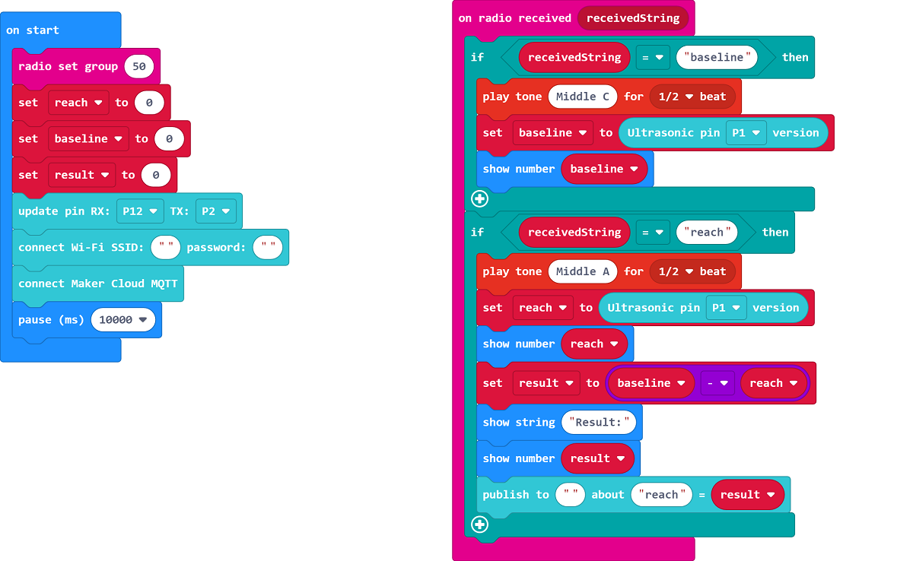
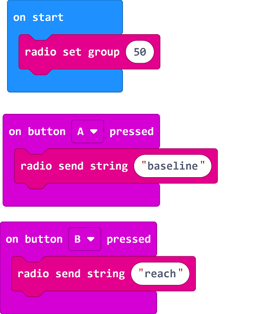

# 3. Sit and Reach Test

Measure the sit and reach distance and upload to IoT platform.

## Building Instructions

[Building Instructions]()

## Sample Program

### Sensor

[Sample Program](https://makecode.microbit.org/_Vgdgqe0kxJk5)

### Controller

[Sample Program](https://makecode.microbit.org/_5aifcuU6xgW6)

## 使用方法

1. Place the sensor on a table facing a wall.
2. Turn on the Robotbit and wait for Wifibrick to connect to MakerCloud.
3. Sit right and hold out the hands, push the device against the tip of the hand, press A on the controller to set a baseline.
4. Push the sensor towards the wall, press B on the controller to measure the distance.
5. The sensor will show and upload the sit and reach distance onto MakerCloud.