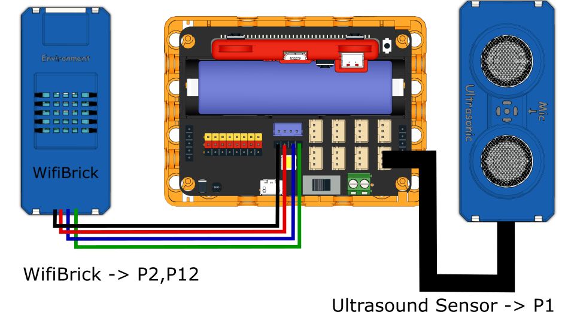

# 2. Sit-Up Exercise

The number of sit-ups can be uploaded to the IoT platform.

## Building Instructions

[Building Instructions]()

## Sample Program

[Sample Program](https://makecode.microbit.org/_MpRaVHYYLKg7)

## Instructions

1. Fix the ultrasound sensor on a wall, the height should be similar to the user's head.
3. Turn on the Robotbit and wait for Wifibrick to connect to MakerCloud.
4. When the user is doing sit-ups, the device will beep when the user moves up to the acceptable distance.
5. Then the user can sit back down, until the device beeps again to signal the user to sit up.
6. Press A to check the number of sit-ups done and upload the data onto MakerCloud.
7. Press B to reset the counter to zero.