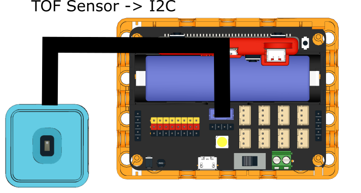
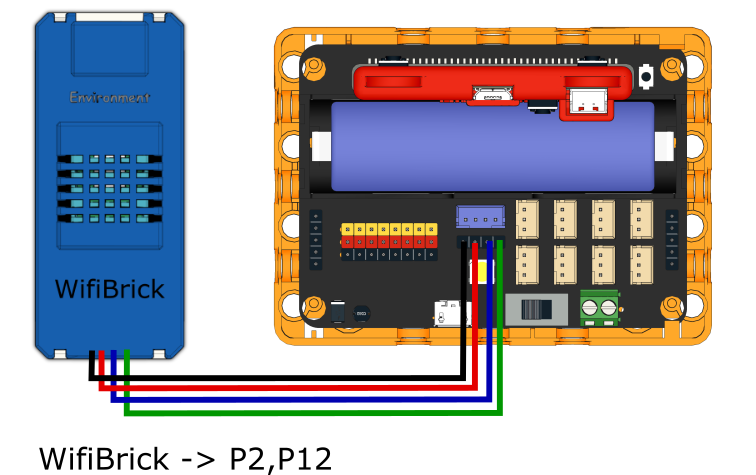
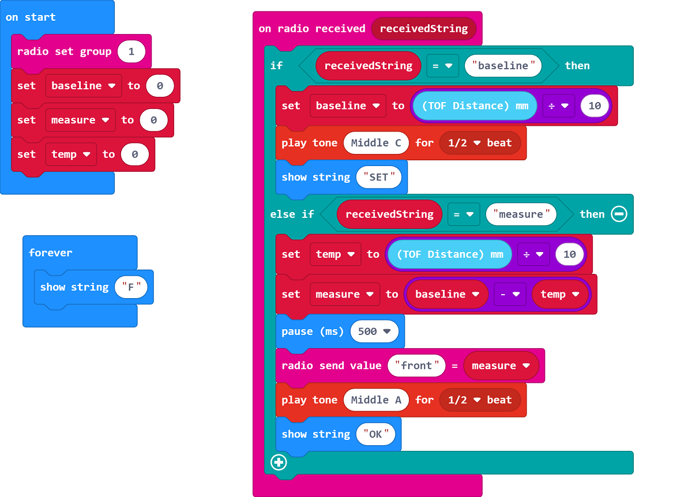
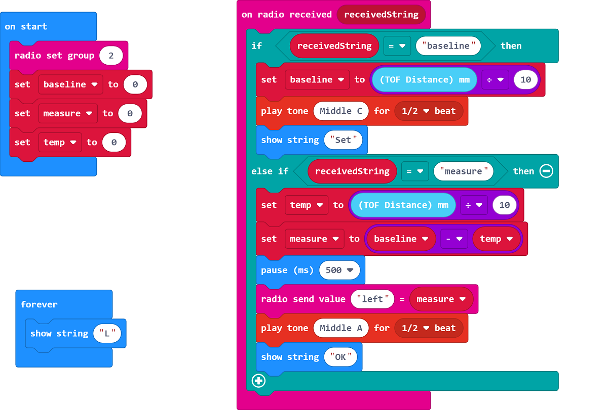
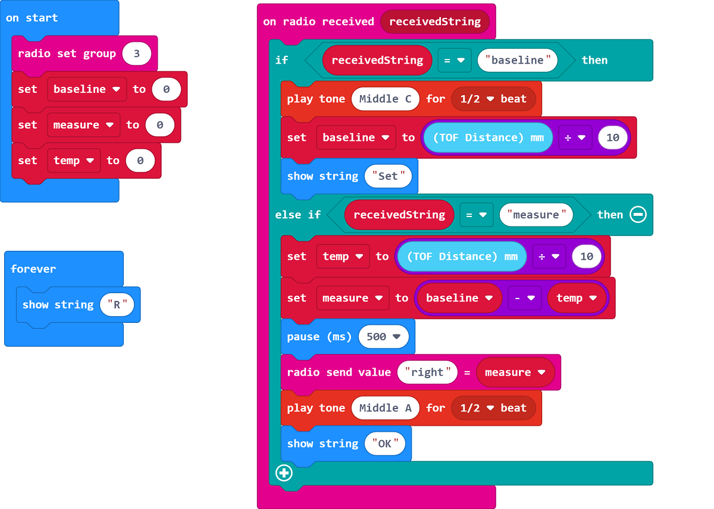
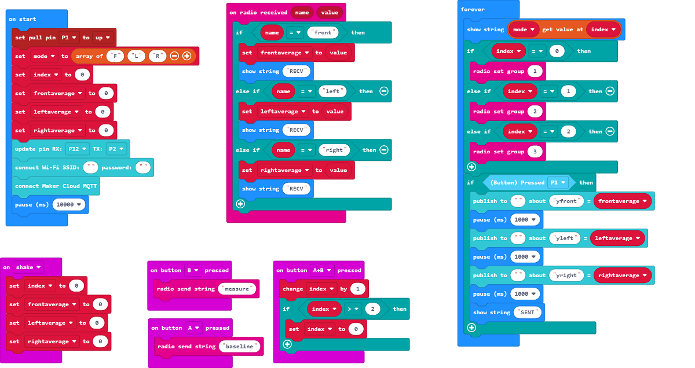

# 4. Y-Balance Test

Measure the Y-Balance distance and upload to IoT platform.

## Building Instructions

[Building Instructions]()

### Sensor

### Controller

## Sample Program

### Sensor(Front)

[Sample Program](https://makecode.microbit.org/_Tf63UpRzp9xK)

### Sensor(Left)

[Sample Program](https://makecode.microbit.org/_K3Jhvx9qDLRE)

### Sensor(Right)

[Sample Program](https://makecode.microbit.org/_Y3mKwmWcxiey)

### Controller

[Sample Program](https://makecode.microbit.org/_TUKAEaFcqdVM)

## Instructions

1. Make a big Y with tape on the ground. (Approx. 1m for each sid)
2. Place the corresponding sensor on the end of each line(F,L,R).
3. Place a little box on the center of the Y.
4. The system measures the Front, Left and then Right, the controller will show the current mode.
5. Press A on the controller to set a baseline on the current mode.
6. Ask the user to push the box with his/her feet along the line, press B on the controller when the user reaches the limit.
7. Press A+B to switch modes.
8. Repeat until all 3 lines are measured, press the button module to upload the data onto MakerCloud.
