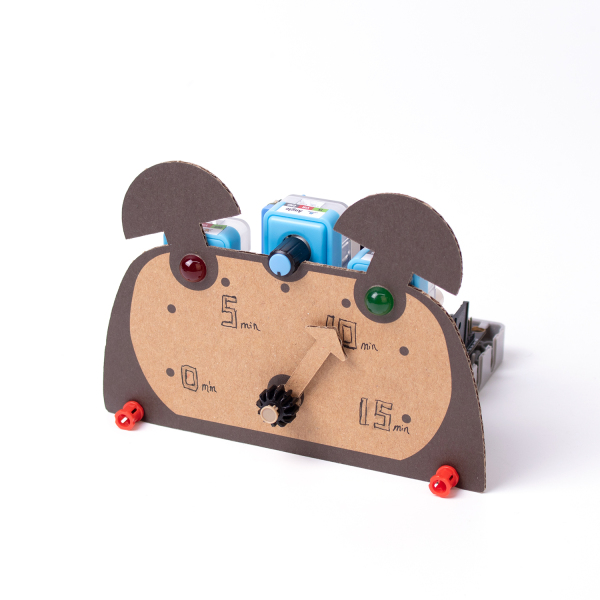

# FutureBoard IoT Education Kit

FutureBoard IoT Education Kit is an education kit designed for FutureBoard with its main focus on IoT applications such as Smart Home and Smart Traffic.

The topics provide grounded and concrete concepts for students to understand and learn IoT in a fun and easy manner.

10 Smart City scenarios let students be at the forefront of technological advancements and inspire their creativity.

## Special Features

1. The full color TFT screen makes learning and programming more interesting
2. 10 Use Case scenarios focusing on IoT in daily lives, students can have a more solid understanding of IoT
3. Hands on experience of building and programming, learning the basics of IoT in a concrete and comprehensive manner

## Product Specifications

- Package Dimensions: 205 x 182 x 75 mm
- Weight: 600 g

## Package Contents

- FutureBoard x1
- Robotbit Edu x1
- Robotbit ABS Base x1
- 18650 Lithium Ion Battery x1
- Sugar LED Modules x3
- Sugar Button Module x1
- Sugar Light Sensor Module x1
- Sugar Line Sensor Module x1
- Sugar Magnet Sensor Module x1
- Sugar Environment Sensor Module x1
- Sugar PIR Sensor Module x1
- Sugar Joystick Module x1
- Sugar TOF Distance Module x1
- GeekServo 2KG Servo x1
- GeekServo 2KG Motor x1
- Plastic Building Bricks Set x1
- Structural Cardboard x3
- 3Pin Cables x6
- 4Pin Cables x2
- USB Cable x1

## Scenario Showcase

### 1. Weather Helper

Obtains weather information from HKO and displays on the screen.

### 2. Laser Ruler

Measure distance using accurate laser.

### 3. Welcoming Robot

Welcomes customers when they enter a shop.

### 4. Timer

Alarm rings when the time is up.

### 5. Safe

Turn the potentiometer to enter the password, alarm will ring if safe is broken in by force.

### 6. Smart Lamp Post

A smart streetlight that can be controlled through IoT and can adjust brightness.

### 7. Smart Traffic Light

A smart traffic light.

### 8. Smart Parking Lot

Automatic entry and exit of vehicles.

### 9. Autonomous Vehicle

Use joystick or IoT to drive this vehicle.

