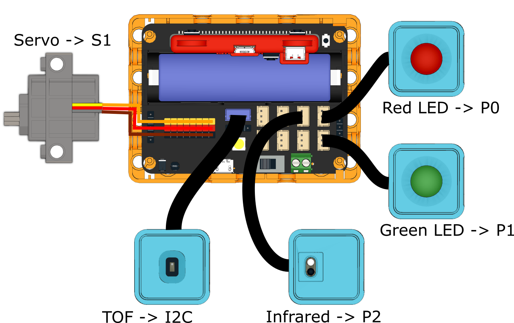

# Smart Parking Lot

Simulate an autonomous parking lot, the gate opens and close automatically, number of available parking space is displayed on the FutureBoard.

## Building Instructions

[Building Instructions](www.google.com)

## Sample Program

[Sample Program](www.google.com)

## Program Instructions

The gate opens when a car drives up to the entrance. When a car is parked in the parking spot, the red light turns on at the entrance to signify a full parking lot, the system will also refuse to let in any car.

When the car occupying the parking space drives away, the FutureBoard will display the parking fee and opens the gate.
