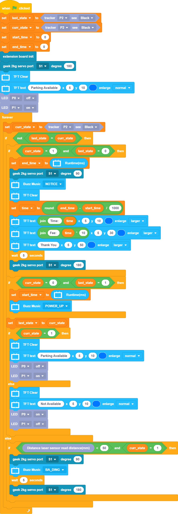

# Smart Parking Lot

Simulate an autonomous parking lot, the gate opens and close automatically, number of available parking space is displayed on the FutureBoard.

## Building Instructions

[Building Instructions(Right Click->Save As)](https://github.com/kittenbothk/kittenbothk/raw/master/Kits/future_inventor/instructions/pdf/parking.pdf)

## Sample Program

### KittenBlock Sample Program

[Download Sample Program(Right Click->Save As)](https://github.com/kittenbothk/kittenbothk/raw/master/Kits/future_inventor/instructions/sb3/parking.sb3)

### Python Sample Program

    #/bin/python

    from time import sleep
    from future import *
    from sugar import *
    import robotbit
    import time
    
    x = 0
    last_state = 0
    curr_state = 0
    start_time = 0
    end_time = 0
    time = 0
    
    last_state = Tracker("P2").value() == 1
    
    curr_state = Tracker("P2").value() == 1
    
    start_time = 0
    
    end_time = 0
    
    robot = robotbit.RobotBit()
    
    robot.geekServo2kg(1, 180)
    
    screen.clear()
    
    screen.text(str("Parking Available"),5,10,1,(0, 119, 255))
    
    LED("P0").state('OFF')
    
    LED("P1").state('ON')
    
    while True:
      curr_state = Tracker("P2").value() == 1
      if not last_state == curr_state:
        if curr_state == 1 and last_state == 0:
          end_time = time.ticks_ms()
          robot.geekServo2kg(1, 90)
          buzzer.melody(NOTICE)
          screen.clear()
          time = (round((end_time - start_time) / 1000))
          screen.text(str(str("Time: ")+str(time)),5,10,2,(0, 119, 255))
          screen.text(str(str("Fee: ")+str(time * 10)),5,30,2,(0, 119, 255))
          screen.text(str("Thank You"),5,50,2,(0, 119, 255))
          sleep(5)
          robot.geekServo2kg(1, 180)
        if curr_state == 0 and last_state == 1:
          start_time = time.ticks_ms()
          buzzer.melody(POWER_UP)
        last_state = curr_state
        if curr_state == 1:
          screen.clear()
          screen.text(str("Parking Available"),5,10,1,(0, 119, 255))
          LED("P0").state('OFF')
          LED("P1").state('ON')
        else:
          screen.clear()
          screen.text(str("Not Available"),5,10,1,(0, 119, 255))
          LED("P0").state('ON')
          LED("P1").state('OFF')
      else:
        if TOFDistance().value() < 50 and curr_state == 1:
          robot.geekServo2kg(1, 90)
          buzzer.melody(BA_DING)
          sleep(5)
          robot.geekServo2kg(1, 180)

[Download Sample Program(Right Click->Save As)](https://github.com/kittenbothk/kittenbothk/raw/master/Kits/future_inventor/instructions/py/parking.py)

## Program Instructions

The gate opens when a car drives up to the entrance. When a car is parked in the parking spot, the red light turns on at the entrance to signify a full parking lot, the system will also refuse to let in any car.

When the car occupying the parking space drives away, the FutureBoard will display the parking fee and opens the gate.
