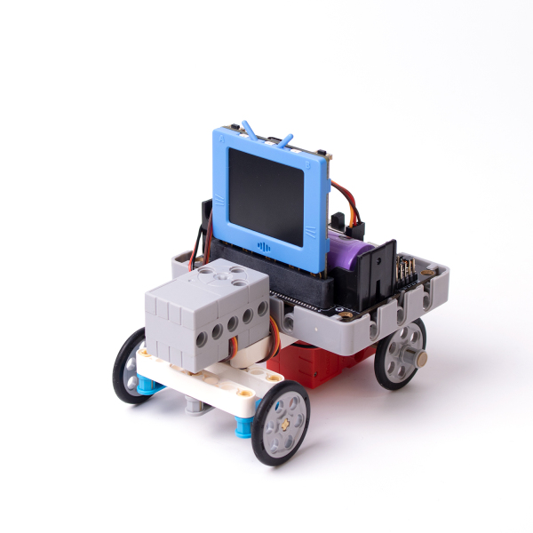
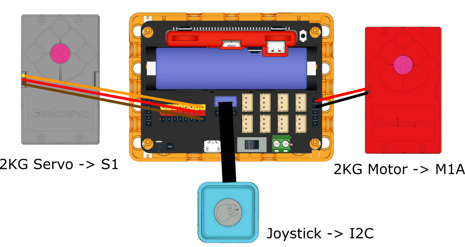
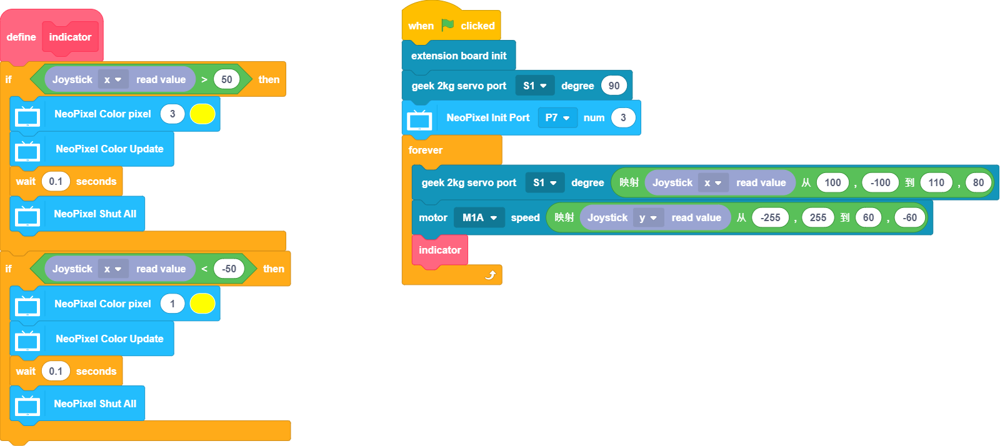

# RC Kart

Control the kart using a Joystick sensor or via an IoT platform.

## Building Instructions

[Building Instructions](www.google.com)

## Joystick Sample Program

[Building Instructions](www.google.com)

## Program Instructions

Push the joystick to control the rc kart. The indicators will light up.