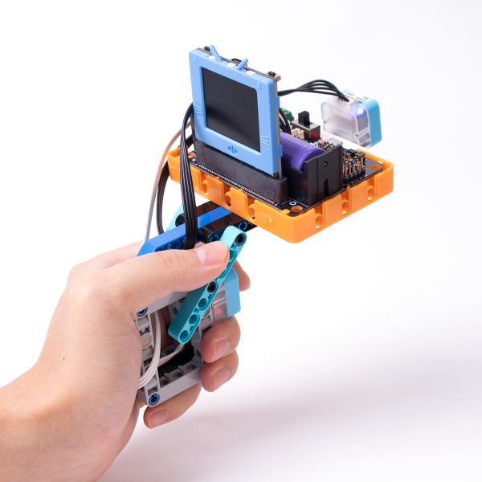
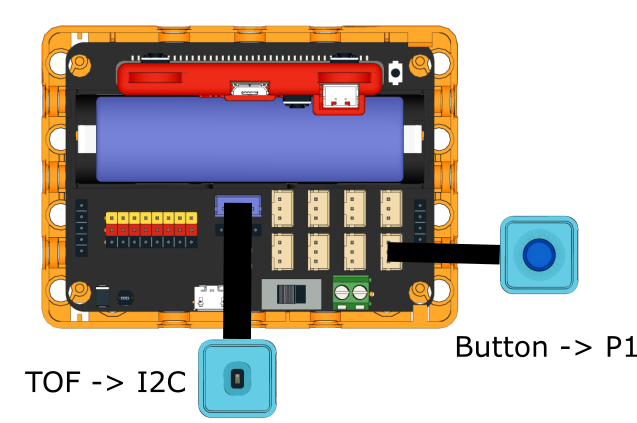
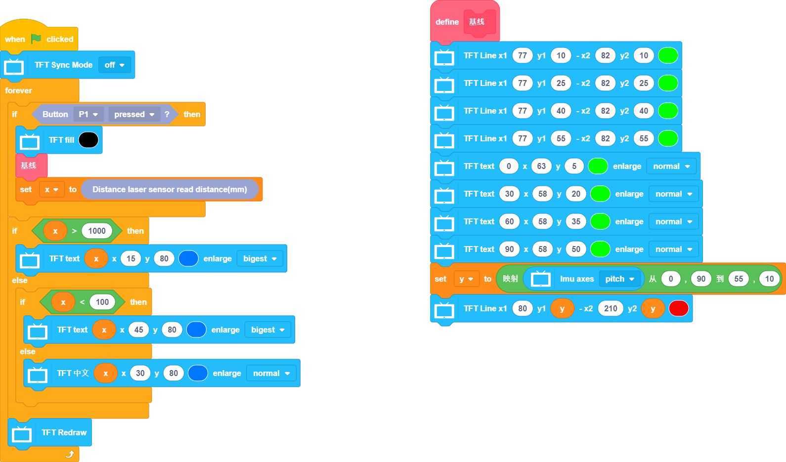

# Laser Distance Ruler

A ruler using a TOF sensor.

## Building Instructions

[Building Instructions](www.google.com)

## Sample Program

[Sample Program](www.google.com)

## Program Instructions

Press the button, the Futureboard will display the distance measured.