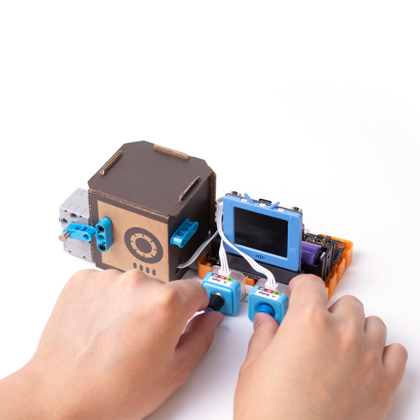
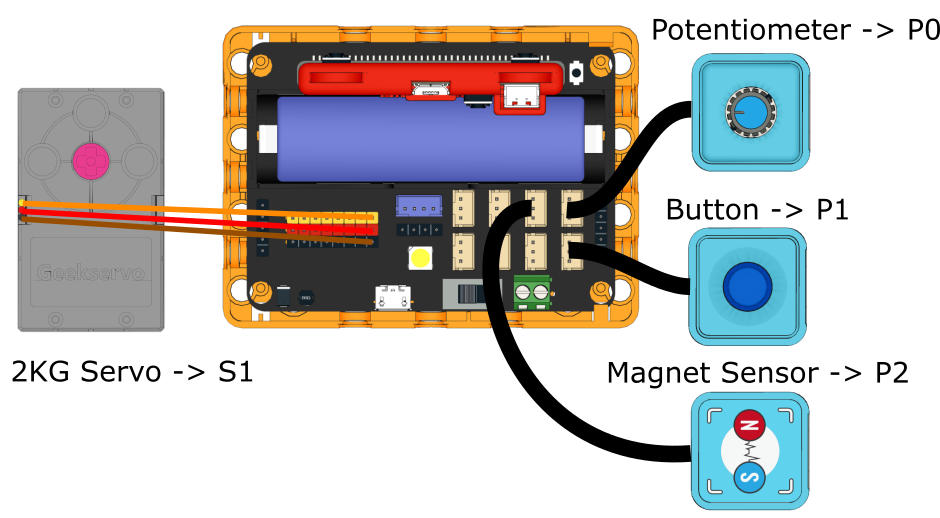

# Safe

Use the potentiometer to select digits and enter the password to open the safe. If the safe is cracked open, the system will sound an alarm.

## Building Instructions

[Building Instructions](www.google.com)

## Sample Program

[Sample Program](www.google.com)

## Program Instructions

Press the button to begin entering password, select a digit by turning the potentiometer, press the button to confirm.
Once 4 digits have been entered, the safe door opens if the password is correct(default: 2021).
