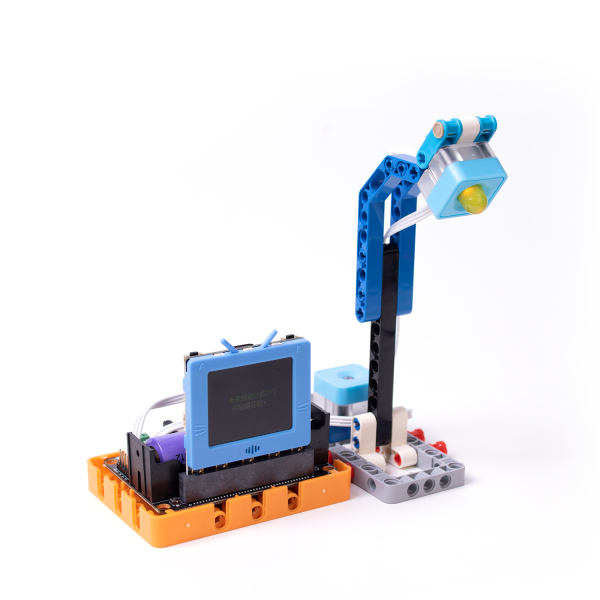

# Smart Streetlamp

A smart streetlamp that can automatically adjusts brightness levels to conserve power.

## Building Instructions

[Building Instructions(Right Click->Save As)](https://github.com/kittenbothk/kittenbothk/raw/master/Kits/future_inventor/instructions/pdf/streetlamp.pdf)

## Sample Program

### FutureBoard Program

### KittenBlock Sample Program

    Enable IoT server in KittenBlock and fill in the IP.

[Download Sample Program(Right Click->Save As)](https://github.com/kittenbothk/kittenbothk/raw/master/Kits/future_inventor/instructions/sb3/streetlamp.sb3)

### Python Sample Program
    
    #Enable IoT server in KittenBlock and fill in the IP.
    #/bin/python
    
    from time import sleep
    from future import *
    from sugar import *
    import mqttsimple
    P0 = MeowPin('P0', 'ANALOG')
    P1 = MeowPin('P1', 'PWM')
    
    
    x = 0
    switch = 0
    
    
    
    wifi.connect(str(""), "")
    
    mqtt = mqttsimple.MQTTClient("192.168.2.161", "mirai",port=1883)
    mqtt.connect()
    
    mqtt.subscribe("/light")
    
    switch = "on"
    
    while True:
      mqtt.check_msg()
      x = mqtt.mqttRead("/light")
      if bool(x):
        if "off" in x:
          switch = "off"
        if "on" in x:
          switch = "on"
      if switch == "on":
        screen.fill((0, 0, 0))
        screen.text(str("ON"),5,10,3,(0, 119, 255))
        P1.setAnalog(1024 - P0.getAnalog(10))
      else:
        screen.fill((0, 0, 0))
        screen.text(str("OFF"),5,10,3,(0, 119, 255))
        P1.setAnalog(0)
      sleep(0.5)

[Download Sample Program(Right Click->Save As)](https://github.com/kittenbothk/kittenbothk/raw/master/Kits/future_inventor/instructions/py/streetlamp.py)

### Kittenblock Program

    Enable IoT server in KittenBlock and fill in the IP.

[Download Sample Program(Right Click->Save As)](https://github.com/kittenbothk/kittenbothk/raw/master/Kits/future_inventor/instructions/sb3/streetlamp_iot.sb3)
## Program Instructions

Remotely turn on or off the streetlamp by using the KittenBlock Client Program, the streetlamp will adjust its brightness based on the environment brightness.
