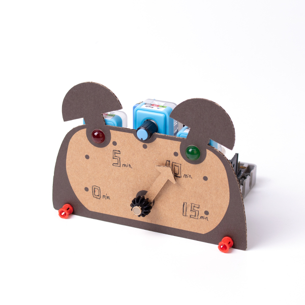
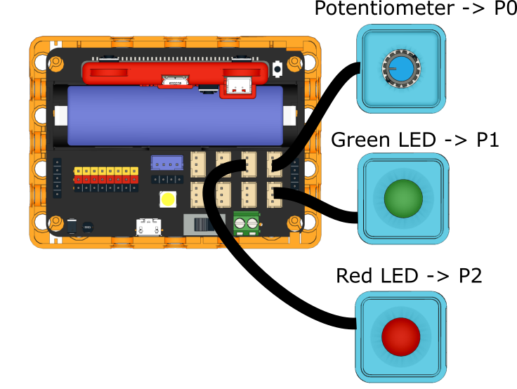
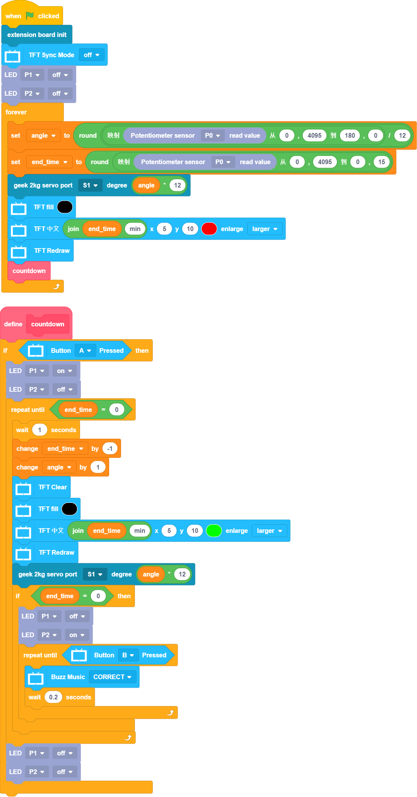

# Timer

The timer will give off audible alarm when the time is up.

## Building Instructions

[Building Instructions](www.google.com)

## Sample Program

[Sample Program](www.google.com)

## Program Instructions

Turn the potentiometer to set the time, press A to start the timer. Press B to stop the timer when the time is up.