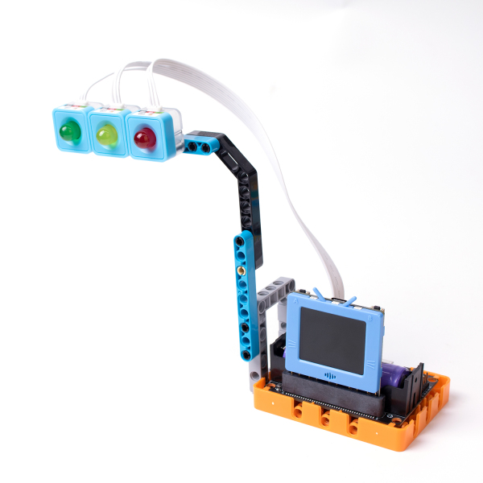
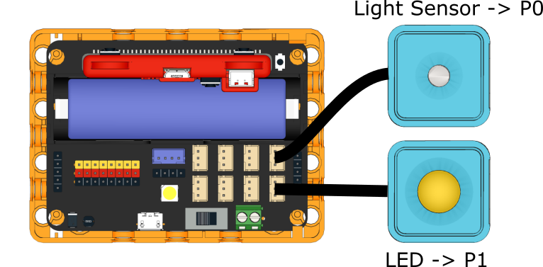
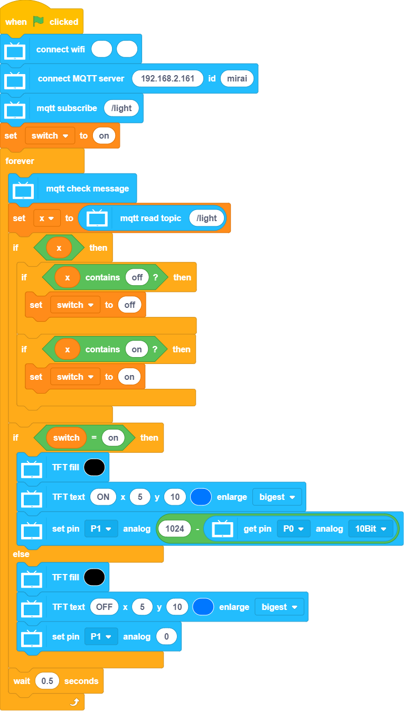
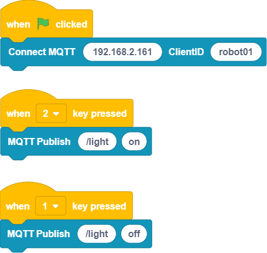

# Smart Traffic Light

Simulates a smart traffic light.

## Building Instructions

[Building Instructions](www.google.com)

## Sample Program

### Kittenblock Client

    Enable local IoT host in KittenBlock and enter the host address into the program.

### Streetlamp Program

    Enable local IoT host in KittenBlock and enter the host address into the program.

[Sample Program](www.google.com)

## Program Instructions

Remotely turn on or off the streetlamp by using the KittenBlock Client Program, the streetlamp will adjust its brightness based on the environment brightness.
