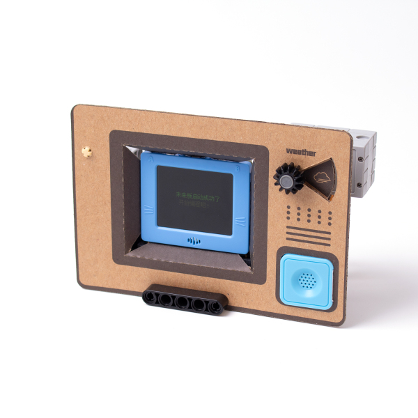
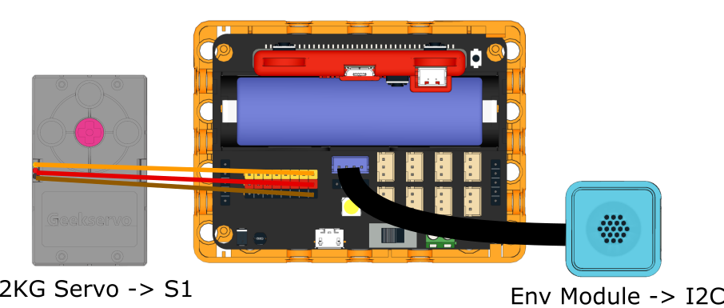

# Weather Station

This weather station can report the local weather from Hong Kong Observatory.

## Building Instructions

[Building Instructions](www.google.com)

## Sample Program

[Sample Program](www.google.com)

## Program Instructions

Modify the program to connect to your WiFi network, FutureBoard will display the current temperature and humidity, the icon will change according to the UV index.