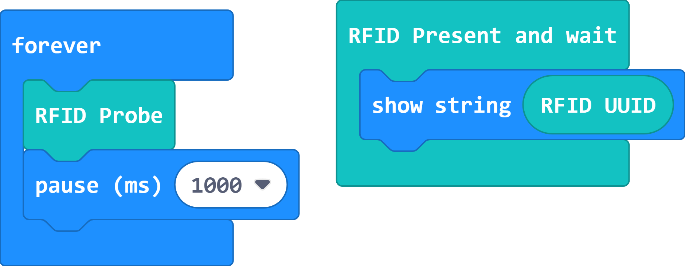
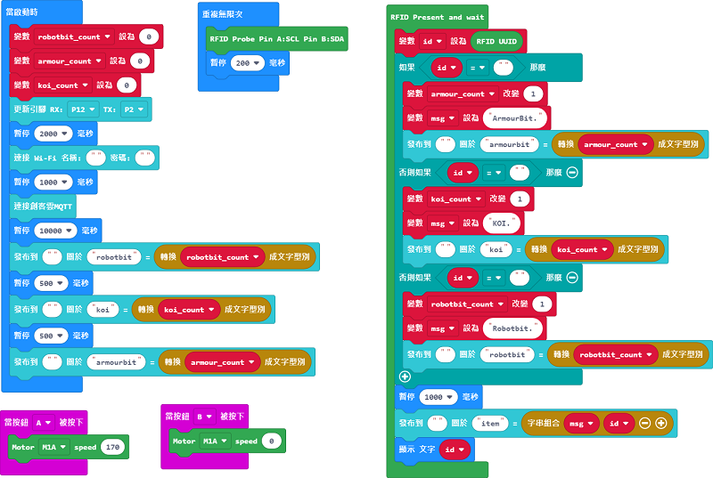
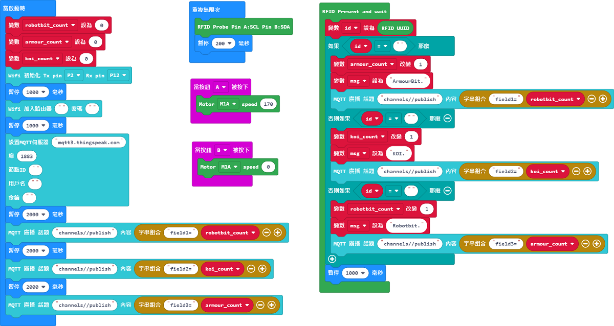

# Inventory System Sample Program(MakeCode)

## RFID Chip Program

Use this program to check the ID of the RFID chips.

[Sample Program](https://makecode.microbit.org/_7mTPaUfz5FLd)

## MakerCloud Sample Program

[Sample Program](https://makecode.microbit.org/_Ef8DP8gCThfX)

### Model Instructions

1. Fill in Wifi login information and MakerCloud MQTT topics
2. Fill in the corresponding RFID number for the product
3. Download the program and turn on the power, wait for the LED to completely light up
4. Press A to turn on the conveyor belt, B to turn if off
5. When the RFID Sensor detects a RFID chip, Micro:bit will display the ID and uploads the information to MakerCloud.

## ObjectBlocks Sample Program

[Sample Program](https://makecode.microbit.org/_9UHYyzdWJM0E)

### Model Instructions

1. Fill in Wifi login information and ObjectBlocks MQTT topics
2. Fill in the corresponding RFID number for the product
3. Download the program and turn on the power, wait for the WifiBrick to connect with ObjectBlocks
4. Press A to turn on the conveyor belt, B to turn if off
5. When the RFID Sensor detects a RFID chip, Micro:bit will display the ID and uploads the information to ObjectBlocks

## ThingSpeak Sample Program

[Sample Program](https://makecode.microbit.org/_RU8DYRgbm1os)

### Model Instructions

1. Fill in Wifi login information and ThingSpeak MQTT topics
2. Fill in the corresponding RFID number for the product
3. Download the program and turn on the power, wait for the WifiBrick to connect with ThingSpeak
4. Press A to turn on the conveyor belt, B to turn if off
5. When the RFID Sensor detects a RFID chip, Micro:bit will display the ID and uploads the information to ThingSpeak

    Note: ThingSpeak does not allow string data, so Item Name and ID will not be supported