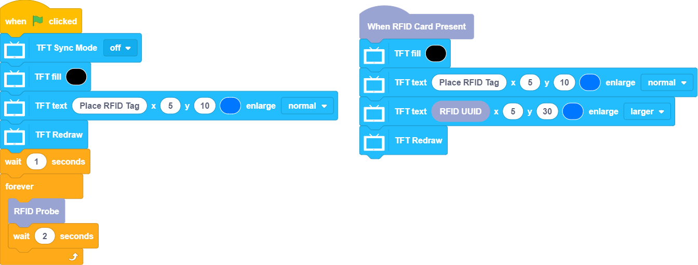
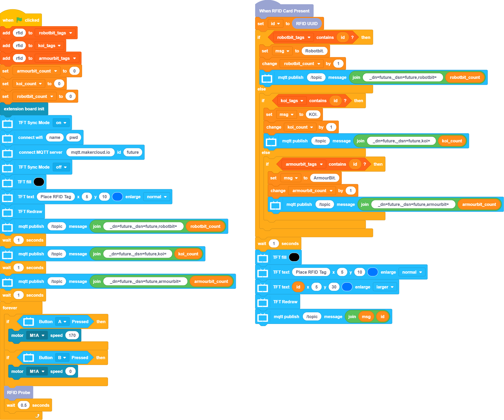
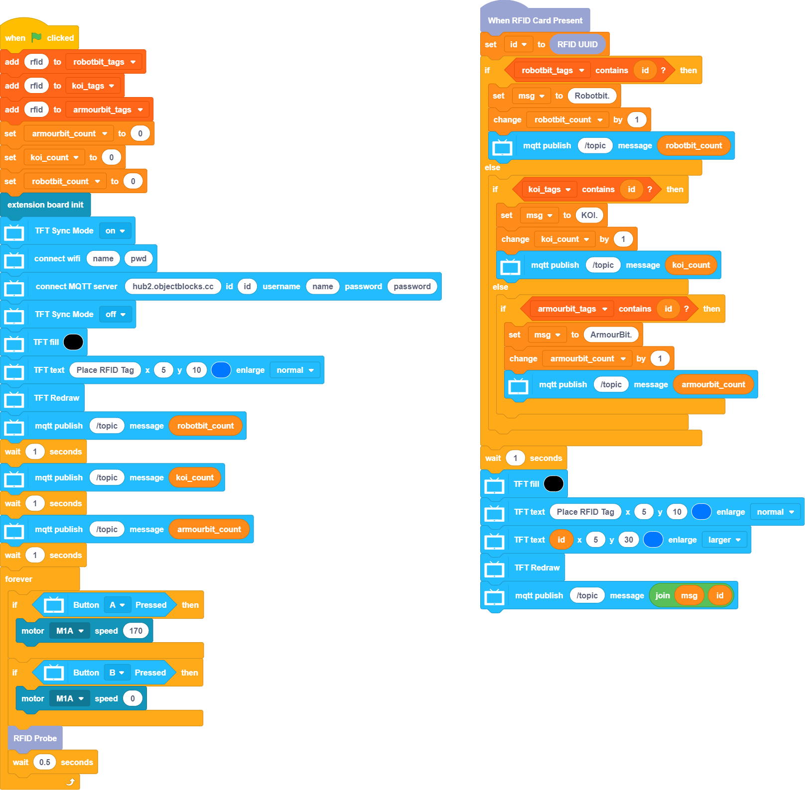

# Inventory System Futureboard Sample Program

## RFID Sample Program

Check the ID of the RFID chips with this program.

[Sample Program](https://github.com/kittenbothk/kittenbothk/blob/master/Kits/inventory_system/images/rfid_futureboard.sb3)

## MakerCloud Sample Program

[Sample Program](https://github.com/kittenbothk/kittenbothk/blob/master/Kits/inventory_system/images/code_makercloud_futureboard.sb3)

### Model Instructions

1. Fill in Wifi login information and MakerCloud MQTT topics
2. Fill in the corresponding RFID ID for the product
3. Download the program and turn on the power, wait for the futureboard to connect to the internet
4. Press A to turn on the conveyor belt, B to turn if off
5. When the RFID Sensor detects a RFID chip, Futureboard will display the ID and uploads the information to MakerCloud

## ObjectBlocks Sample Program

[Sample Program](https://github.com/kittenbothk/kittenbothk/blob/master/Kits/inventory_system/images/code_objectblocks_futureboard.sb3)

### Model Instructions

1. Fill in Wifi login information and Objectblocks MQTT topics
2. Fill in the corresponding RFID ID for the product
3. Download the program and turn on the power, wait for the futureboard to connect to the internet
4. Press A to turn on the conveyor belt, B to turn if off
5. When the RFID Sensor detects a RFID chip, Futureboard will display the ID and uploads the information to Objectblocks

## ThingSpeak Sample Program

[Sample Program](https://github.com/kittenbothk/kittenbothk/blob/master/Kits/inventory_system/images/code_thingspeak_futureboard.sb3)

### Model Instructions

1. Fill in Wifi login information and ThingSpeak MQTT topics
2. Fill in the corresponding RFID ID for the product
3. Download the program and turn on the power, wait for the futureboard to connect to the internet
4. Press A to turn on the conveyor belt, B to turn if off
5. When the RFID Sensor detects a RFID chip, Futureboard will display the ID and uploads the information to ThingSpeak
    

    Note: ThingSpeak only supports numeric data so item ID and item name is not supported in this program