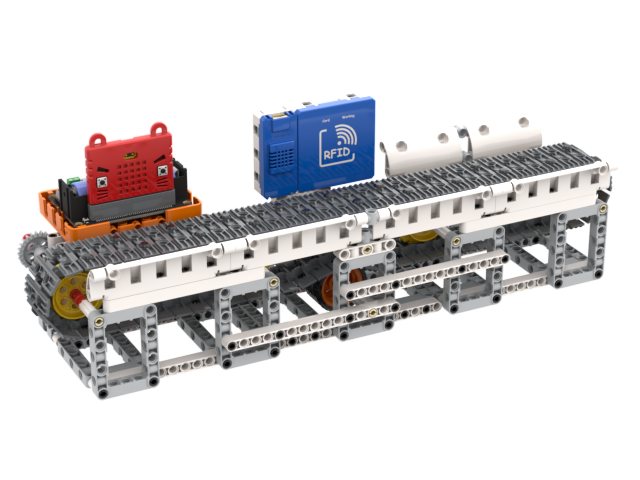

# Inventory Management System

Inventory Management System simulates a factory conveyor belt transporting goods, the rfid sensor detects the rfid chip on the product.

## Special Features

- Based on block programming for Micro:bit, suitable for beginners
- High expandability due to use of plastic building bricks
- Supports both MakeCode and KittenBlock programming

## Kit Contents

- Robotbit Edu Expansion Board x1
- Plastic Building Bricks x1
- GeekServo 2KG Motor x1
- WifiBrick x1
- Powerbrick RFID Module x1
- 18650 Battery x1
- RFID Chips