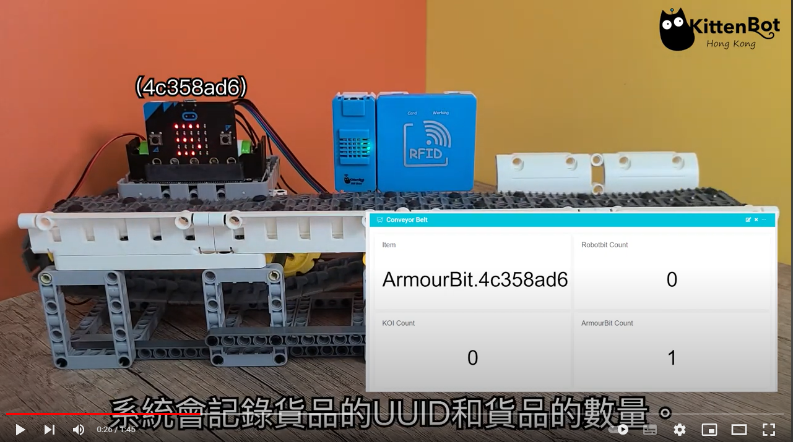

# Industry 4.0 Conveyor Belt

Industry 4.0 Conveyor Belt simulates a factory conveyor belt transporting goods, the rfid sensor detects the rfid chip on the product and updates the information on the IoT platform.

## Special Features

- Based on block programming for Micro:bit, suitable for beginners
- High expandability due to use of plastic building bricks
- Supports both MakeCode and KittenBlock programming
- Applies Industry 4.0 concepts such as IoT, automation

## Kit Contents

- Robotbit Edu Expansion Board x1
- Plastic Building Bricks x1
- GeekServo 2KG Motor x1
- WifiBrick x1
- Powerbrick RFID Module x1
- 18650 Battery x1
- RFID Chips x5

## Demo Video

)

[Demo Video](https://youtu.be/VdKa_Eb6fHo)