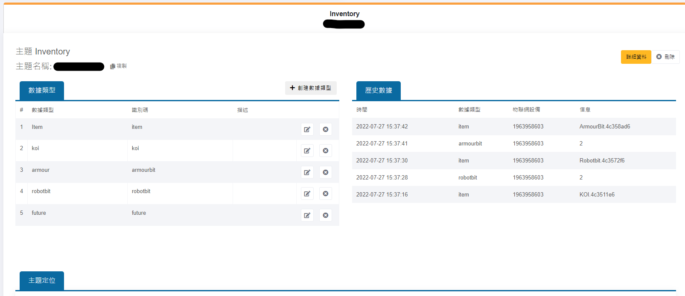
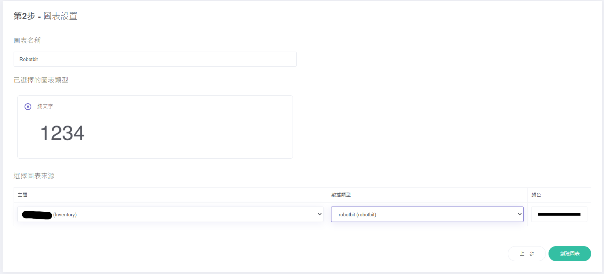
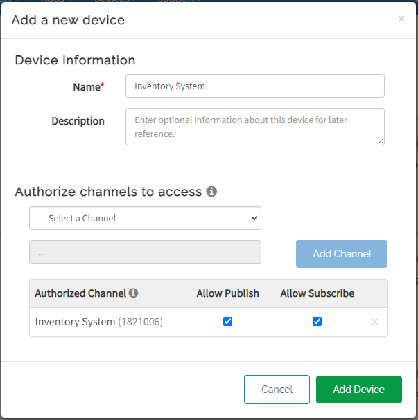

# IoT Platform Set Up Tutorial

You will find the set up tutorial for the different platforms here.

## MakerCloud Platform Set Up Tutorial

Create a new MQTT topic on MakerCloud and create data types: item, koi, robotbit, armourbit. (Reference)

Create charts for each data type.

Create dashboard and insert the charts.

## ObjectBlocks Platform Set Up Tutorial

Create a new project.

Create channels: Robotbit, Armourbit, KOI, Item. (Make sure webhook option is enabled)

Create new dashboard.

Create tools to display the channel data.

## ThingSpeak Platform Set Up Tutorial

Create a ThingSpeak will data fields: Robotbit, KOI, Armourbit.

Set channel visibility to public.

Set up MQTT device.

Please store the login credentials properly.

