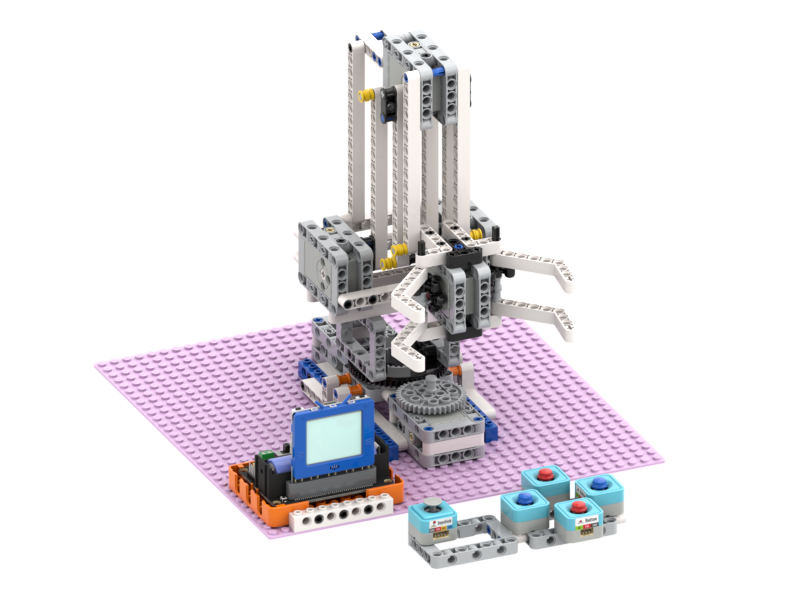
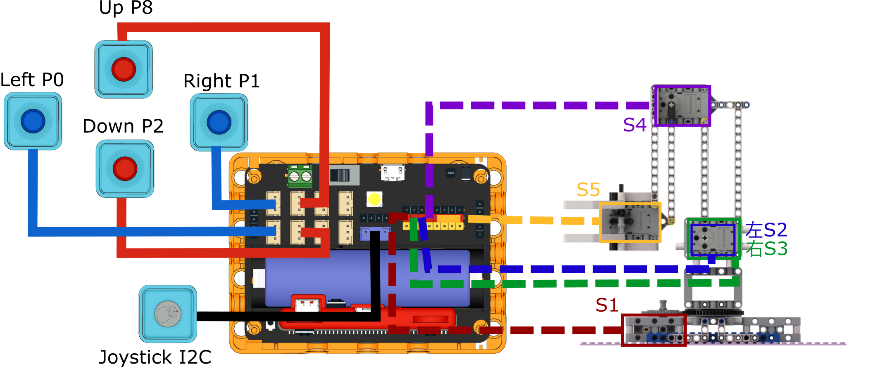
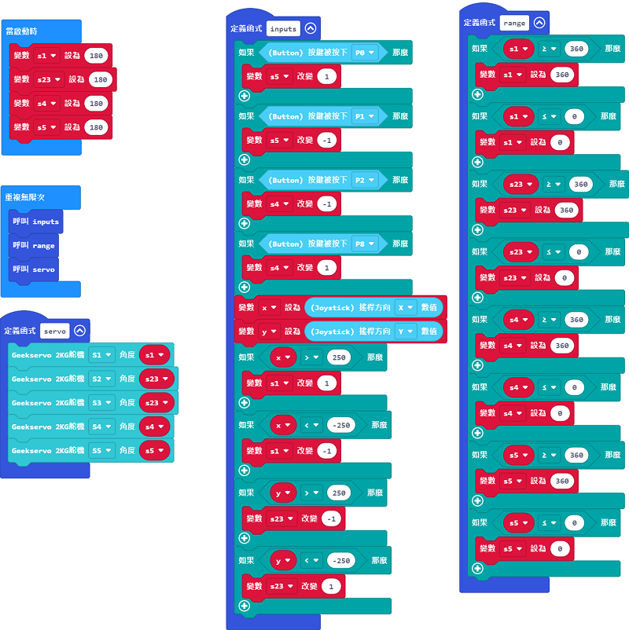
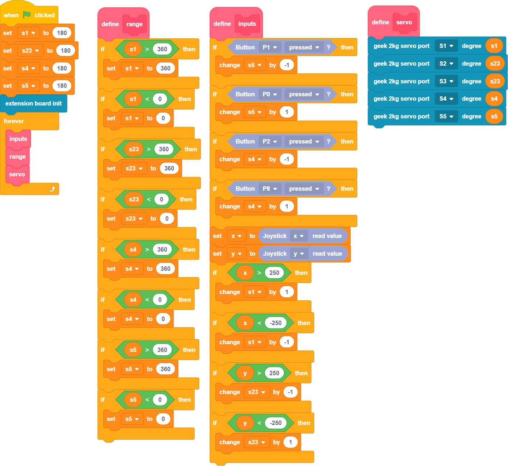

# Industry 4.0 Robotic Arm

This Robotic Arm is built of plastic building blocks, it features 5 Geekservo 2KG servos.

## Kit Contents

1. Robotbit Edu x1
2. 18650 Lithium Battery x1
3. Geekservo 2KG Servos x5
4. Sugar Button Modules x4
5. Sugar Joystick Module x1
6. Building Blocks Set
7. Connecting Cables

## Features

- Powered by 2KG servos to ensure stability in operation
- Mechanical structure allows students to learn mechanical engineering concepts
- Improving engineering skills by hands-on construction of the robot arm
- Brick-built structure allows flexibility in modifying to suit different scenarios

## Building Instructions

[Download Building Instructions(Right Click->Save As)](https://github.com/kittenbothk/kittenbothk/raw/master/Kits/lego_robot_arm/lego_robot_arm.pdf)

## Sample Wiring Diagram

### Robotbit EDU

## Sample Program

### Micro:bit Sample Program

[Sample Program](https://makecode.microbit.org/_A9cCYFVWr3e3)

### FutureBoard Sample Program

### KittenBlock Sample Program

[Sample Program(Right Click->Save As)](https://github.com/kittenbothk/kittenbothk/raw/master/Kits/lego_robot_arm/robot_arm.sb3)

### Python Sample Program

    #/bin/python
    
    from future import *
    from sugar import *
    import robotbit
    
    x = 0
    s1 = 0
    s23 = 0
    s4 = 0
    s5 = 0
    y = 0

    def inputs():
      global x,s1,s23,s4,s5,y
    
      if Button("P1").value() == 0:
        s5 += -1
      if Button("P0").value() == 0:
        s5 += 1
      if Button("P2").value() == 0:
        s4 += -1
      if Button("P8").value() == 0:
        s4 += 1
      x = Joystick().value('x')
      y = Joystick().value('y')
      if x > 250:
        s1 += 1
      if x < -250:
        s1 += -1
      if y > 250:
        s23 += -1
      if y < -250:
        s23 += 1
    
    def range():
      global x,s1,s23,s4,s5,y
    
      if s1 > 360:
        s1 = 360
      if s1 < 0:
        s1 = 0
      if s23 > 360:
        s23 = 360
      if s23 < 0:
        s23 = 0
      if s4 > 360:
        s4 = 360
      if s4 < 0:
        s4 = 0
      if s5 > 360:
        s5 = 360
      if s5 < 0:
        s5 = 0
    
    def servo():
      global x,s1,s23,s4,s5,y
      robot.geekServo2kg(1, s1)
      robot.geekServo2kg(2, s23)
      robot.geekServo2kg(3, s23)
      robot.geekServo2kg(4, s4)
      robot.geekServo2kg(5, s5)

    
    s1 = 180
    s23 = 180
    s4 = 180
    s5 = 180
    
    robot = robotbit.RobotBit()
    while True:
      inputs()
      range()
      servo()

[Sample Program(Right Click->Save As)](https://github.com/kittenbothk/kittenbothk/raw/master/Kits/lego_robot_arm/robot_arm.py)

