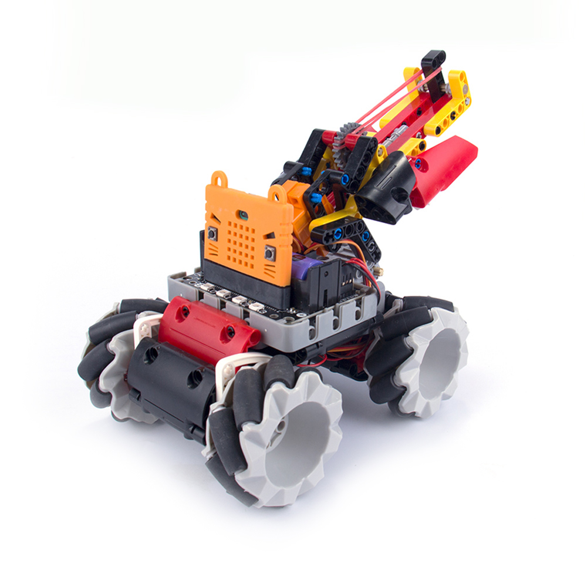
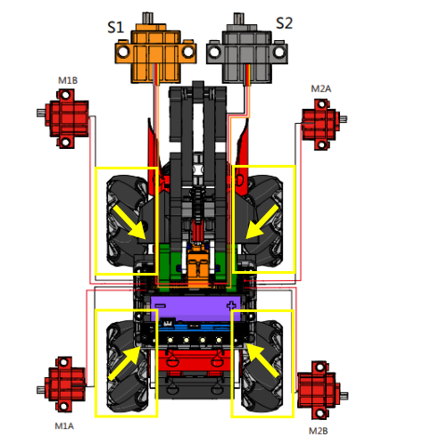

# Mecanum Robotic Shooter

## Building Instructions and Sample Programs

[Building Instruction Booklets](https://bit.ly/MRMacanumWheelBuildingInstruction)

### Attention!!!

#### Mecanum Wheels must be installed according to the orientation shown in the instruction booklet!

[Sample Program: Robotic Shooter](https://makecode.microbit.org/_UD7XueM2oC2o)

[Sample Program: JoyFrog Controller](https://makecode.microbit.org/_ddya6e8pADDs)

## Operating Instructions

### JoyFrog Controller:

1. Load the rubber bands by placing the rubber bands between the teeth of the gear.
2. Turn on the power after the rubber bands have been loaded.
3. Use the analog stick to move the robotic car.
4. Press Y to switch to rotation mode to adjust its rotation.
5. Press A and B to adjust the angle of the turret.
6. Press X to fire the rubber bands.