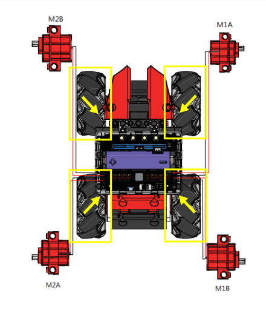

# Mecanum Robotic Car

## Building Instructions and Sample Programs

[Building Instruction Booklets](https://bit.ly/MRMacanumWheelBuildingInstruction)

### Attention!!!

#### Mecanum Wheels must be installed according to the orientation shown in the instruction booklet!

[Sample Program: Robotic Car](https://makecode.microbit.org/_ed6Mh7F81Hvg)

[Sample Program: Micro:bit Controller](https://makecode.microbit.org/_D3k7FL38TPC3)

[Sample Program: JoyFrog Controller](https://makecode.microbit.org/_Kv1Pe6VseDFJ)

## Operating Instructions

### Microbit Controller:

1. Turn on the power.
2. Press B to connect with the robot.
3. Use the accelerometer for movement.
4. Press A to switch to rotation mode to adjust the angle.

### JoyFrog Controller:

1. Turn on the power.
2. Press B to connect with the robot.
3. Use the joystick for movement.
4. Press A to switch to rotation mode to adjust the angle.